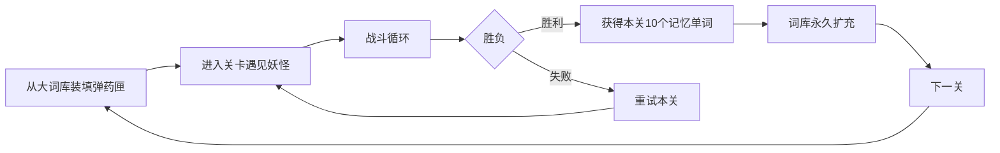
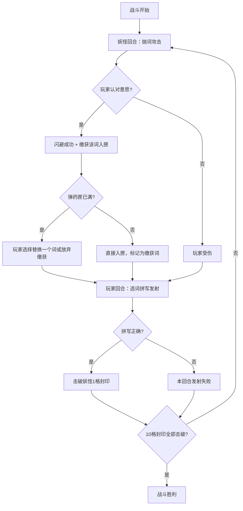
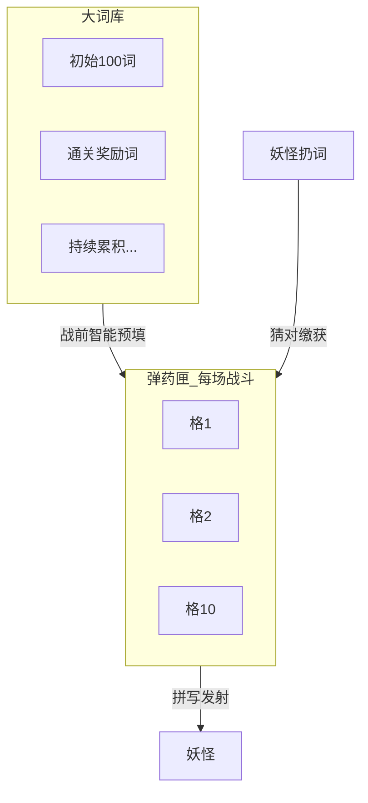
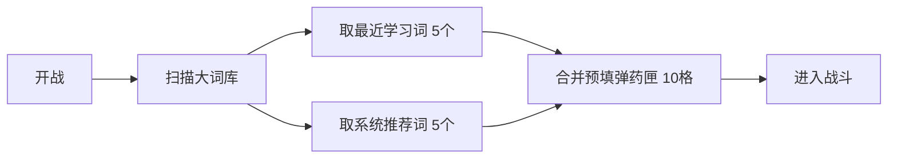
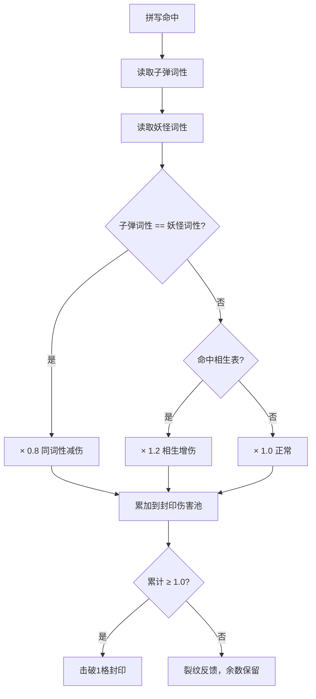
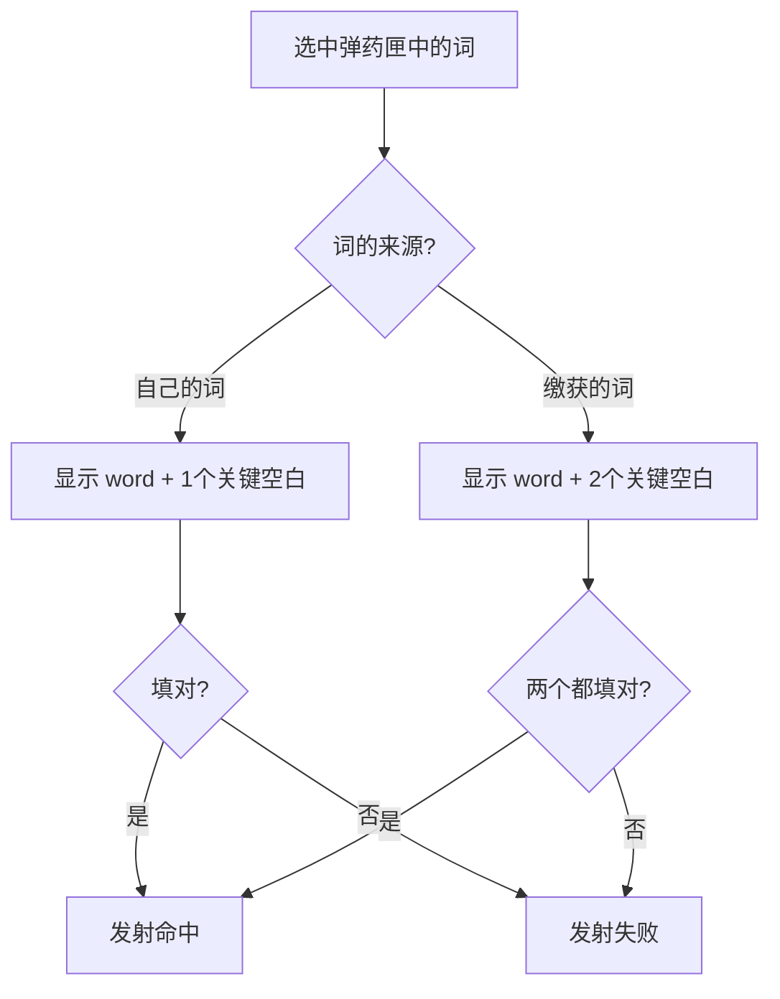
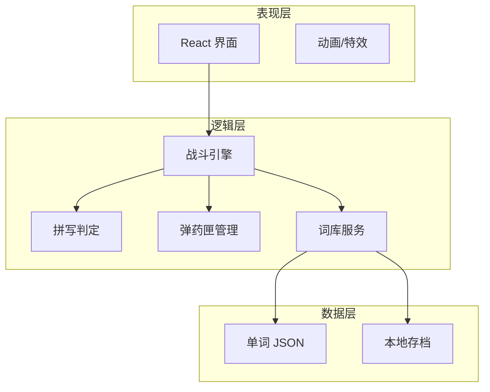

# DOC-DES-001 Word Hunter 玩法设计文档

| 属性 | 内容 |
|------|------|
| 项目名称 | Word Hunter（单词猎人） |
| 文档版本 | v1.4 |
| 创建日期 | 2026-06-20 |
| 文档状态 | 已确认 |
| 平台 | 网页游戏（浏览器打开即玩） |
| 战斗强度 | 标准模式（约 5 分钟/关，有倒计时与轻度压力） |

---

## 1. 项目概述

### 1.1 一句话描述

用你已掌握的单词作为弹药，在回合制战斗中击败妖怪，夺取它的记忆（新单词），一路闯关走向胜利。

### 1.2 核心价值

- **学词有动机**：单词不是题库里的条目，而是战斗中的子弹与战利品。
- **攻防一体**：防守认词、缴获弹药；进攻拼写、击破封印。
- **难度递进**：自己的词快射（1 个关键字母），缴获的词难射（2 个关键字母），形成自然学习曲线。

### 1.3 目标用户

- 英语初学者，已具备约 **100 个基础单词** 的认知储备。
- 希望在碎片时间（单次 5 分钟左右）通过游戏化方式巩固词汇。

### 1.4 设计目标

| 目标 | 说明 |
|------|------|
| 好玩 | 有资源博弈（10 格弹药匣）、有紧张感（倒计时）、有成长感（词库膨胀） |
| 好学 | 固定挖「关键字母」，针对易错点而非随机碰运气 |
| 可验证 | 网页 MVP 可快速试玩，验证核心循环是否成立 |

---

## 2. 核心玩法循环

### 2.1 宏观循环



### 2.2 单场战斗循环



### 2.3 一局战斗在做什么（玩家视角）

1. 战前从 **大词库** 中选最多 **10 个词** 装入 **弹药匣**。
2. 妖怪每回合扔一个单词；**认对意思** 则闪避并 **缴获** 该词进弹药匣。
3. 玩家回合从弹药匣选词，按来源完成 **关键字母拼写** 后发射。
4. 每次有效命中击破妖怪 **1 格记忆封印**（共 10 格）。
5. 10 格全部击破 → 胜利；玩家 HP 归零 → 失败，可重试。

---

## 3. 双仓库系统

游戏中有两个层次上的「单词容器」，职责严格分离。

### 3.1 大词库（军火库）

| 属性 | 说明 |
|------|------|
| 初始容量 | 100 个基础单词（开局自带） |
| 增长方式 | 每击败一个妖怪，永久获得该关 **10 个主题单词** |
| 用途 | 战前选择装填弹药匣；记录玩家长期学习进度 |
| 状态展示 | 熟词发亮 / 生词灰化 / 未解锁（未通关对应关卡） |

### 3.2 弹药匣（战斗背包）

| 属性 | 说明 |
|------|------|
| 容量上限 | **10 格**（整场战斗固定） |
| 装入方式 | ① 战前系统智能预填 ② 战斗中缴获妖怪扔出的词 |
| 用途 | **唯一** 可用于进攻的单词来源 |
| 战斗结束 | 清空，不保留到下一关 |



---

## 4. 战前准备

### 4.1 弹药装填规则：智能预填 10 词

每场战斗开始前，系统 **自动预填 10 个单词** 到弹药匣，玩家无需手动挑选。预填采用 **5 + 5** 配比：

| 来源 | 数量 | 说明 |
|------|------|------|
| **最近学习词** | 5 个（50%） | 优先来自玩家 **最近缴获/新学会** 的词 |
| **系统推荐词** | 5 个（50%） | 本关主题词 + 复习词，由系统按算法选取 |



### 4.2 「最近学习词」定义

**最近学习词** = 大词库中 **最近获得** 的单词，按学习时间倒序排列。来源优先级：

| 优先级 | 来源 | 说明 |
|--------|------|------|
| 1 | **缴获入库** | 以往战斗中猜中妖怪扔的词，战后永久入库（`learnedVia: captured`） |
| 2 | **通关奖励** | 击败妖怪后获得的 10 个主题词（`learnedVia: victory`） |
| 3 | **初始词库** | 开局 100 词（`learnedVia: starter`），仅在前两类不足时补足 |

**选取规则：**

1. 按 `firstLearnedAt`（首次入库时间）**从新到旧**排序。
2. 同时间内 **缴获入库** 优先于通关奖励。
3. 取前 **5 个** 作为「最近学习词」装入弹药匣，标记为 **自己的词**（1 空拼写）。
4. 若最近学习词 **不足 5 个**（如第 1 关），用 **本关主题词** 补足，仍凑满 5 格。

### 4.3 「系统推荐词」定义

剩余 **5 格** 由系统推荐，目的是 **复习 + 预习本关**：

| 优先级 | 来源 | 数量建议 |
|--------|------|----------|
| 1 | 本关主题词（尚未入库的） | 优先填满 |
| 2 | 本关主题词（已入库的） | 复习巩固 |
| 3 | 大词库中熟悉度中等的词 | 补足至 5 个 |

推荐词同样标记为 **自己的词**（1 空拼写）。

**与最近学习词去重：** 若某词已在「最近学习 5 词」中，系统推荐侧 **跳过该词**，改选下一个候选。

### 4.4 各阶段预填差异

| 阶段 | 关卡 | 最近学习 5 词 | 系统推荐 5 词 |
|------|------|---------------|---------------|
| 教学 | 1–2 | 多为初始词 + 已缴获词；不足用本关主题词补 | 本关主题词为主 |
| 成长 | 3–5 | 以缴获入库 + 上关通关词为主 | 本关主题词 + 复习词 |
| 挑战 | 6+ | 近 3 场战斗新词优先 | 本关主题词 + 低熟悉度词 |

第 1–2 关仍为 **教学关**（伤害减半等），但装填逻辑与后续关卡 **同一套 5+5 规则**，不再使用「纯主题词配装」。

### 4.5 预填预览（可选交互）

- 开战前展示 **预填结果预览**（10 词列表：哪些是最近学习、哪些是系统推荐）。
- 玩家 **不能直接改选**，只能点「开始战斗」；保留爽感与确定性，避免选择疲劳。
- v2 可开放「替换其中 1–2 个词」作为进阶功能。

### 4.6 装填策略（系统侧）

系统通过 5+5 配比，在每场战斗自动形成以下学习节奏：

| 配比意图 | 效果 |
|----------|------|
| 50% 最近学习词 | 巩固刚缴获/刚学会的词，趁记忆新鲜用 1 空快射 |
| 50% 系统推荐词 | 预习或复习本关主题，保证关卡词汇覆盖 |
| 战斗中继续缴获 | 弹药匣可在战内被缴获词替换/扩充，形成二次博弈 |

---

## 5. 战斗系统

### 5.1 双方属性

**玩家**

| 属性 | 默认值 | 说明 |
|------|--------|------|
| HP | 100 | 被妖怪击中时扣除 |
| 弹药匣 | 0–10 格 | 见第 3 节 |
| 倒计时 | 8 秒/回合 | 超时视为答错 |

**妖怪**

| 属性 | 默认值 | 说明 |
|------|--------|------|
| 记忆封印 | 10 格 | 每被有效命中击破 1 格 |
| 攻击词库 | 本关 10 个主题词 + 玩家大词库 | 见 5.2 |
| 特殊技能 | 因妖而异 | 见第 7 节 |

### 5.2 妖怪攻击回合（防御 / 缴获）

**流程**

1. 妖怪向玩家 **抛出一个英文单词**（屏幕显示单词）。
2. 玩家从 **4 个中文释义** 中选择正确答案（MVP 题型）。
3. 判定：
   - **答对** → 闪避成功（0 伤害）+ **缴获该词** 进入弹药匣流程。
   - **答错** → 受到伤害（默认 -15 HP）。
   - **超时** → 同答错。

**妖怪扔词的来源**

| 来源 | 权重建议 | 目的 |
|------|----------|------|
| 本关 10 个主题词 | 70% | 让玩家反复接触本关核心词汇 |
| 玩家大词库已学词 | 30% | 复习旧词，避免只背新词 |

**缴获入匣规则**

1. 缴获词标记为 **「缴获词」**（进攻时需 2 个关键字母拼写）。
2. 弹药匣 **未满** → 直接入匣。
3. 弹药匣 **已满（10 格）** → 玩家必须：
   - **替换**：选择匣中一个词丢弃，换入缴获词；或
   - **放弃**：不缴获，仅闪避成功。

### 5.3 玩家攻击回合（拼写发射）

**流程**

1. 玩家从弹药匣中 **选择一个词**。
2. 系统按词的来源与预设 `keySlots` 显示带空白的单词。
3. 玩家填写空白字母。
4. 判定：
   - **填对** → 发射命中，按 **词性相生相克** 计算伤害，击破或削弱妖怪封印（见 5.5）。
   - **填错** → 本回合发射失败，不击破封印，不消耗该词（可再次选用）。

**发射失败不扣玩家 HP**，仅浪费一个进攻回合；妖怪下回合继续攻击。

### 5.4 胜负条件

| 结果 | 条件 | 后果 |
|------|------|------|
| **胜利** | 妖怪 10 格封印全部击破 | 本关 10 个主题词永久写入大词库；解锁下一关 |
| **失败** | 玩家 HP ≤ 0 | 本关重试；词库不减少；可选复习闪卡后再战 |
| **平局保护** | 单场最长 20 回合 | 超过后妖怪进入「狂暴」：攻击间隔缩短（防拖局） |

### 5.5 词性相生相克系统

单词与妖怪均拥有 **词性属性**（名词 / 动词 / 形容词 / 副词）。玩家需根据妖怪的词性，选择 **相生词性** 增伤或避免 **同词性** 减伤。

五行（金木水火土）仅作为 **词性的视觉配色**，不参与伤害计算。

#### 5.5.1 词性与五行（视觉映射）

每个单词标注 **词性（partOfSpeech）**；五行由词性自动推导，用于 UI 配色：

| 词性 | 五行色 | 意象 | 示例词 |
|------|--------|------|--------|
| **名词** | 金 | 具体事物、实体 | apple, water, friend |
| **动词** | 火 | 动作、能量 | run, eat, think |
| **形容词** | 水 | 状态、性质描述 | happy, big, cold |
| **副词** | 木 | 方式、程度修饰 | quickly, very, often |
| **其他** | 土 | 介词、连词等 | in, and, oh |

#### 5.5.2 妖怪词性属性

每关妖怪固定一种 **词性属性**（战斗属性），与关卡主题一致：

| 关卡 | 妖怪 | 词性属性 | 主题词域 |
|------|------|----------|----------|
| 1 | 迷雾小妖 | **形容词** | 日常问候 |
| 2 | 火焰魔 | **动词** | 食物饮料 |
| 3 | 冰霜鬼 | **名词** | 天气季节 |
| 4 | 暗影兽 | **名词** | 动物 |
| 5 | 森林精灵 | **形容词** | 颜色形状 |
| 6+ | 待扩展 | 四类词性轮换 | 按主题迭代 |

#### 5.5.3 相生相克伤害规则（已确认）

**基础伤害**：每次拼写命中造成 **1.0 点封印伤害**。

伤害系数由 **子弹词性** 与 **妖怪词性** 的关系决定：

| 关系 | 伤害系数 | 说明 | 示例（妖怪=动词） |
|------|----------|------|-------------------|
| **相生** | **× 1.2** | 伤害增加 20% | 发射 **副词**（副词修饰动词） |
| **同词性** | **× 0.8** | 伤害减弱 20% | 发射 **动词**（同属性抵抗） |
| **其他** | **× 1.0** | 正常伤害 | 发射名词、形容词等 |

**相生判定：修饰关系表**

相生 = 子弹词性在语法上 **修饰 / 强化** 妖怪词性：

| 妖怪词性 | 相生（+20%）子弹词性 | 语法关系 |
|----------|----------------------|----------|
| **名词** | 形容词 | 形容词修饰名词（big apple） |
| **动词** | 副词 | 副词修饰动词（run quickly） |
| **形容词** | 副词 | 副词修饰形容词（very happy） |
| **副词** | 动词 | 动词承载副词（动词体现动作方式） |
| **其他** | — | 无相生，全部 × 1.0 |

**同词性减伤**：子弹词性 **==** 妖怪词性时，一律 × 0.8（与相生互斥，相生优先判定前先检查同词性）。

**判定优先级**：

1. 若子弹词性 == 妖怪词性 → **× 0.8**
2. 否则若命中相生表 → **× 1.2**
3. 否则 → **× 1.0**



**累积伤害制**（封印击破判定）：

- 妖怪 10 格封印 = **10.0 点**封印生命。
- 每次命中：`累计 += 1.0 × 伤害系数`，满 1.0 碎 1 格，余数保留。

**数值示例（妖怪 = 动词）**：

| 子弹词性 | 系数 | 单次伤害 | 击破 10 格约需 |
|----------|------|----------|----------------|
| 副词（相生） | 1.2 | 1.2 | **9 次** |
| 动词（同词性） | 0.8 | 0.8 | **13 次** |
| 名词（其他） | 1.0 | 1.0 | **10 次** |
| 形容词（其他） | 1.0 | 1.0 | **10 次** |

#### 5.5.4 策略深度

| 场景 | 玩家决策 |
|------|----------|
| 动词妖（火焰魔） | 优先装填 / 缴获 **副词** 弹药（相生 +20%） |
| 动词妖面前 | 避免用 **动词** 射击（-20%） |
| 形容词妖 | 找 **副词** 打；避开形容词 |
| 名词妖 | 找 **形容词** 打；避开名词 |
| 预填 5+5 | 系统推荐词倾向 **相生词性**，帮玩家破局 |

#### 5.5.5 UI 表现

- 妖怪头顶：**词性徽章**（名/动/形/副）+ 五行配色。
- 弹药匣词条：词性图标 + 五行色点。
- 相生命中：子弹 **高亮膨胀**、提示「相生 +20%」、封印猛碎。
- 同词性命中：子弹 **黯淡**、提示「同词性 -20%」、封印微裂。
- 其他命中：正常碎裂特效。

---

## 6. 拼写发射系统（核心差异化机制）

### 6.1 双轨难度

| 单词来源 | 拼写要求 | 设计意图 |
|----------|----------|----------|
| **自己的词**（战前装填） | 固定挖 **1 个** 关键字母 | 熟词快射，保持战斗节奏 |
| **缴获的词**（猜中妖怪扔的词） | 固定挖 **2 个** 关键字母 | 新词门槛高，强化记忆 |



### 6.2 关键字母定义

**关键字母** = 该单词中最容易拼错、或最能代表拼写特征的字母位置。

每场战斗、每次发射，**同一单词挖空位置固定不变**（读取词库预设，不随机）。

**挖空优先级（从高到低）**

| 优先级 | 类型 | 示例 |
|--------|------|------|
| 1 | 易混淆拼写 | receive → **ei**；friend → **ie** |
| 2 | 静音字母 | knife → **k**；island → **s** |
| 3 | 双写辅音 | apple → 其中一个 **p** |
| 4 | 不规则元音 | women → **o**；busy → **u** |
| 5 | 词尾不规则 | beautiful → **u**、**a**；Wednesday → **e**、**d** |

**不挖空的位置**

- 首字母（过于简单）
- 仅凭发音即可猜到的末尾字母（除非整词很短）

### 6.3 短词降级规则

| 单词长度 | 自己的词（1 空） | 缴获的词（2 空） |
|----------|------------------|------------------|
| ≤4 字母 | 1 个关键字母 | **降级为 1 个**关键字母 |
| 5–6 字母 | 1 个关键字母 | 2 个关键字母 |
| ≥7 字母 | 1 个关键字母 | 2 个关键字母 |

### 6.4 拼写界面示例

**自己的词（1 空）**

```
  a p p _ e
  ─────────
  只需填对第二个 p
```

**缴获的词（2 空）**

```
  m _ n s t _ r
  ─────────────
  需填对 n 和 e（位置由词库固定）
```

### 6.5 缴获词拼写规则（已确认）

- **一次填完**：两个空白 **必须在同一轮内全部填对**，才算发射成功。
- **拼错不重试**：本回合内 **不允许重试**；发射失败后直接进入妖怪回合。
- **下回合再选**：该词仍保留在弹药匣中，玩家可在后续进攻回合 **重新选用** 再次拼写。

### 6.6 学习梯度（单条词的生涯）


---

## 7. 妖怪系统

### 7.1 妖怪与关卡主题

每关一只妖怪，对应 **10 个主题单词**。击败后这 10 个词永久进入大词库。

| 关卡 | 妖怪 | 词性 | 主题词域 | 特殊行为 |
|------|------|------|----------|----------|
| 1 | 迷雾小妖 | 形容词 | 日常问候 | 选项文字轻微模糊（教学关，伤害减半） |
| 2 | 火焰魔 | 动词 | 食物饮料 | 答错时附加「灼烧」：下回合 -5 HP |
| 3 | 冰霜鬼 | 名词 | 天气季节 | 玩家答题倒计时缩短至 6 秒 |
| 4 | 暗影兽 | 名词 | 动物 | 第 4 个干扰项为近义词 |
| 5 | 森林精灵 | 形容词 | 颜色形状 | 攻击时展示图片，不展示英文 |
| 6+ | 待扩展 | 轮换 | 按主题迭代 | 组合前述机制 |

### 7.2 妖怪记忆封印（HP 表现）

- UI 表现为妖怪身上 **10 块记忆碎片** / 封印槽（等价 10.0 点封印生命）。
- 每次玩家 **拼写命中** → 按 **词性相生相克** 结算伤害，累加后击破封印格（见 5.5.3）。
- 相生命中：封印 **强碎**；同词性命中：封印 **微裂**；其他：正常碎裂。
- 全部击碎 → 妖怪消散，掉落 10 个记忆单词动画。

### 7.3 狂暴机制（防拖局）

- 战斗超过 **20 回合** → 妖怪进入狂暴。
- 效果：玩家倒计时 -2 秒；妖怪攻击伤害 +5。
- 促使玩家积极进攻，而非只防守缴获。

---

## 8. 趣味增强机制

以下机制提升「好玩」程度；**MVP 可选实现**，按优先级排列。

### 8.1 连击 Combo（推荐 MVP 实现）

| 连续答对次数 | 效果 |
|--------------|------|
| 3 次 | 下一发伤害特效升级（视觉） |
| 5 次 | 「暴击」：击破封印时附带震动特效 + 奖励音效 |
| 断连 | Combo 归零 |

连击同时适用于 **防御认词** 与 **进攻拼写**。

### 8.2 闪避反击（v2）

- 防御回合 **2 秒内** 答对 → 触发「闪避反击」。
- 本回合可 **额外免费发射一次**（仍需拼写，但无妖怪插回合）。

### 8.3 本战临时晋升（v2）

- 同一缴获词在本战中 **2 空拼对命中 2 次** → 临时降为 **1 空** 拼写。
- 战斗结束后仍按大词库状态决定下一场难度（缴获变自己的词后才永久 1 空）。

### 8.4 战利品仪式（推荐 MVP 实现）

- 胜利后 10 个词以「记忆碎片飞入词库」动画呈现。
- 每个词展示 3 秒闪卡（英文 + 中文 + 1 空/2 空预览），玩家点击继续。

### 8.5 成就系统（v2）

| 成就 | 条件 |
|------|------|
| 百发百中 | 一场战斗零失误 |
| 以彼之道 | 仅用缴获词完成最后一击 |
| 词汇大师 | 大词库达到 200 词 |

---

## 9. 难度与节奏

### 9.1 战斗强度：标准模式

| 参数 | 值 |
|------|-----|
| 单场时长 | 约 5 分钟 |
| 倒计时 | 8 秒/回合（部分妖怪可缩短） |
| 预计回合数 | 12–18 回合 |
| 玩家失误容忍 | 约 6–7 次答错仍可获胜 |

### 9.2 关卡难度曲线


| 阶段 | 关卡 | 装填 | 题型 | 拼写 |
|------|------|------|------|------|
| 教学 | 1–2 | 智能预填 5+5 | 四选一认义 | 1空 / 2空 |
| 成长 | 3–5 | 智能预填 5+5 | 四选一认义 | 1空 / 2空 |
| 挑战 | 6+ | 智能预填 5+5 | 认义 + 看图选词 | 1空 / 2空，短词以外无降级 |

### 9.3 失败保护

- 失败不扣词库、不降级。
- 重试前提供 **30 秒迷你闪卡**：本关 10 词快速过一遍。
- 同一关连续失败 3 次 → 触发「妖怪虚弱」：伤害 -30%。

---

## 10. 词库与数据规范

### 10.1 单词数据结构

```json
{
  "id": "word_001",
  "word": "beautiful",
  "meaning": "美丽的",
  "phonetic": "/ˈbjuːtɪfl/",
  "theme": "appearance",
  "difficulty": 2,
  "keySlots": {
    "own": [1],
    "captured": [1, 7]
  },
  "keySlotHint": "ea 元音 + 末尾 ul",
  "monsterLevel": 5
}
```

**字段说明**

| 字段 | 类型 | 说明 |
|------|------|------|
| `word` | string | 英文单词 |
| `meaning` | string | 中文释义（四选一题的正确项） |
| `keySlots.own` | int[] | 自己的词：固定 1 个挖空索引（0-based） |
| `keySlots.captured` | int[] | 缴获的词：固定 2 个挖空索引；短词可为 1 个 |
| `monsterLevel` | int | 首次作为哪关妖怪主题词出现 |

### 10.2 关键字母标注策略

**MVP 采用：人工标注为主**

- 100 个初始词 + 前 5 关 50 个主题词，全部人工审定 `keySlots`。
- 标注质量直接影响学习效果，不依赖随机算法。

**v2 可选：规则辅助生成**

- 基于静音字母、双写、ie/ei 规则自动生成候选位置，人工抽检修正。

### 10.3 初始 100 词与关卡主题词

- **初始 100 词**：玩家开局大词库，涵盖最高频基础词汇（问候、数字、颜色、家庭成员等）。
- **每关 10 主题词**：与当关妖怪主题一致；首次通关后并入大词库。
- 第 1 关示例主题词：hello, hi, good, morning, night, thank, please, sorry, yes, no。

### 10.4 干扰项生成

四选一认义题的错误选项：

1. 同主题近义或相关词释义。
2. 拼写相近词的释义。
3. 随机但词性相同的释义。

避免过于离谱的干扰项。

---

## 11. 界面与交互要点（网页）

### 11.1 主要界面

| 界面 | 功能 |
|------|------|
| 首页 | 开始游戏 / 继续进度 |
| 词库 | 浏览大词库、查看熟练度 |
| 战前预填 | 系统按 5+5 规则自动装填弹药匣，可预览不可改选 |
| 战斗界面 | 妖怪、玩家 HP、封印槽、弹药匣、倒计时 |
| 拼写弹窗 | 显示带空白的单词与字母输入 |
| 胜利结算 | 记忆碎片动画 + 闪卡复习 |
| 失败结算 | 重试 / 复习再战的入口 |

### 11.2 战斗界面布局（示意）

```
┌─────────────────────────────────────────────┐
│  [关卡2] 火焰魔          HP: ████████░░ 80  │
│                    🧟 妖怪立绘               │
│          记忆封印: ◆◆◆◆◆◇◇◇◇◇◇ (5/10)        │
├─────────────────────────────────────────────┤
│  妖怪抛出:  apple                           │
│  选择释义:  [ ] 苹果  [ ] 香蕉  [ ] 橙子 ... │
│                          倒计时: ████░ 5s    │
├─────────────────────────────────────────────┤
│  弹药匣 (7/10):                             │
│  [hello] [water] [happy] [缴获:friend] ...  │
│  选中 → 拼写:  fr _ end  →  [发射]          │
├─────────────────────────────────────────────┤
│  玩家 HP: ██████████░░  HP 100    Combo x3  │
└─────────────────────────────────────────────┘
```

### 11.3 反馈与音效

| 事件 | 视觉 | 音效 |
|------|------|------|
| 认词成功 | 闪避残影 | 清脆「叮」 |
| 缴获入匣 | 词飞入弹药匣 | 装填声 |
| 1 空拼对 | 快速子弹 | 短促发射 |
| 2 空拼对 | 蓄力 + 重击 | 低沉发射 |
| 击破封印 | 封印碎裂 | 碎玻璃声 |
| 胜利 | 妖怪消散 + 碎片飞入 | 胜利旋律 |

---

## 12. 技术方向（网页 MVP）

### 12.1 推荐技术栈

| 层级 | 选型 | 理由 |
|------|------|------|
| 框架 | React + TypeScript | 组件化战斗 UI，生态成熟 |
| 游戏表现 | Phaser 3 或纯 CSS 动画 | 妖怪与子弹特效；MVP 可先用 CSS |
| 状态管理 | Zustand | 战斗状态、词库、进度轻量管理 |
| 存储 | localStorage | 词库与关卡进度本地存档 |
| 构建 | Vite | 快速开发与热更新 |

### 12.2 模块划分



### 12.3 核心逻辑类（建议）

| 模块 | 职责 |
|------|------|
| `BattleEngine` | 回合流转、胜负判定、倒计时 |
| `AmmoClip` | 10 格弹药匣：装填、缴获、替换、丢弃 |
| `SpellChecker` | 按 keySlots 判定拼写正误 |
| `WordBank` | 大词库 CRUD、熟练度、解锁状态 |
| `MonsterAI` | 选词攻击、权重、特殊技能 |
| `DistractorGen` | 四选一干扰项生成 |

---

## 13. MVP 范围

### 13.1 必做（第一版）

- [ ] 初始 100 词 + 前 5 关各 10 主题词（共 150 词，keySlots 人工标注）
- [ ] 大词库 + 10 格弹药匣
- [ ] 完整战斗循环：防御认词 → 缴获 → 拼写发射
- [ ] 双轨拼写（1 空 / 2 空，固定关键字母）
- [ ] 词性相生相克系统（相生 +20%、同词性 -20%、累积伤害）
- [ ] 5 个妖怪（含词性属性与基础特殊行为）
- [ ] 玩家 HP、妖怪 10 格封印
- [ ] 倒计时、基础 Combo 视觉
- [ ] 本地存档
- [ ] 胜利记忆碎片动画 + 简易闪卡

### 13.2 不做（第一版）

- 联机 / 排行榜
- 付费 / 内购
- 复杂剧情与 NPC
- 属性克制扩展（相克增伤，v2）
- 听音拼写、造句题（留给 v2）
- 账号登录与云存档

---

## 14. 验收标准

| 编号 | 场景 | 预期结果 |
|------|------|----------|
| AC-01 | 新用户首次进入 | 拥有 100 词大词库，可开始第 1 关 |
| AC-02 | 第 1 关战斗 | 系统智能预填 10 词（5 最近学习 + 5 推荐），可预览后开战 |
| AC-03 | 妖怪扔词，玩家认对 | 0 伤害，词缴获入匣，标记为缴获词 |
| AC-04 | 弹药匣满时缴获 | 弹出替换/放弃选择 |
| AC-05 | 用自己的词发射，1 空填对 | 按词性相生相克结算封印伤害 |
| AC-05b | 相生命中（如动词妖+副词弹） | 封印伤害 ×1.2 |
| AC-05c | 同词性命中（如动词妖+动词弹） | 封印伤害 ×0.8 |
| AC-05d | 其他词性命中 | 封印伤害 ×1.0 |
| AC-06 | 用缴获词发射，2 空填对 | 同样适用五行伤害规则 |
| AC-07 | 拼写填错 | 本回合发射失败且不可重试，词仍在匣中，下回合可再选 |
| AC-08 | 10 格封印全部击破 | 胜利，10 个主题词永久入大词库 |
| AC-09 | HP 归零 | 失败，可重试，词库不减少 |
| AC-10 | 刷新页面 | 进度与词库从本地存档恢复 |

---

## 15. 已确认决策

| 编号 | 决策 | 结论 |
|------|------|------|
| D-01 | 缴获词 2 空拼写方式 | **一次填完**，两个空全部正确才算命中 |
| D-02 | 拼错重试 | **本回合不允许重试**；下回合可重新选用同一词 |
| D-03 | keySlots 标注 | MVP **100% 人工标注** |
| D-04 | 妖怪扔词范围 | 仅 **本关主题词 + 玩家已学词** |
| D-06 | 战前装填方式 | **系统智能预填 10 词**：50% 最近学习（缴获优先）+ 50% 系统推荐 |
| D-07 | 词性相生相克 | 相生 ×1.2；同词性 ×0.8；其他 ×1.0；五行仅 UI 配色 |

## 16. 待决事项

| 编号 | 问题 | 当前默认 | 优先级 |
|------|------|----------|--------|
| OQ-01 | 战斗超时狂暴回合数 20 是否合适？ | 待试玩调整 | P3 |

---

## 17. 版本记录

| 版本 | 日期 | 变更说明 |
|------|------|----------|
| v1.0 | 2026-06-20 | 初稿：整合全部玩法讨论，含弹药匣、缴获、双轨关键字母拼写、妖怪关卡、MVP 范围 |
| v1.1 | 2026-06-20 | 确认拼写规则：2 空一次填完、拼错不重试；状态改为已确认 |
| v1.2 | 2026-06-20 | 战前装填改为智能预填：5 最近学习词 + 5 系统推荐词 |
| v1.3 | 2026-06-20 | 新增五行属性系统：词性映射、妖怪属性、同属性减伤 20% |
| v1.4 | 2026-06-20 | 伤害改为词性相生相克：相生 +20%、同词性 -20%；妖怪属性改为词性 |

---

## 附录 A：单局战斗数值参考

| 参数 | 值 | 备注 |
|------|-----|------|
| 玩家初始 HP | 100 | |
| 妖怪封印格数 | 10 | 等价 10.0 点封印生命 |
| 单次基础封印伤害 | 1.0 | 其他词性时全额 |
| 相生伤害系数 | 1.2 | 伤害增加 20% |
| 同词性伤害系数 | 0.8 | 伤害减弱 20% |
| 单次答错伤害 | 15 | 教学关减半 |
| 灼烧附加伤害 | 5 | 下回合额外扣 |
| 倒计时 | 8 秒 | 冰霜鬼关 6 秒 |
| 弹药匣容量 | 10 | |
| 狂暴触发回合 | 20 | |

## 附录 B：关键词表（设计术语）

| 术语 | 英文 | 含义 |
|------|------|------|
| 最近学习词 | Recent Learned | 按入库时间排序，缴获来源优先的预填词池（占 50%） |
| 系统推荐词 | Recommended | 本关主题词与复习词，预填另一半（占 50%） |
| 大词库 | Word Bank | 玩家永久持有的全部单词 |
| 弹药匣 | Ammo Clip | 单场战斗可用最多 10 个进攻单词 |
| 缴获 | Capture | 认对妖怪扔的词后获得该词入匣 |
| 自己的词 | Owned Word | 战前装填或已入库的词，1 空拼写 |
| 缴获的词 | Captured Word | 战斗中缴获的词，2 空拼写 |
| 关键字母 | Key Letter | 词库预设的易错挖空位置 |
| 记忆封印 | Memory Seal | 妖怪 10 格生命；采用累积伤害制（总 10.0 点） |
| 词性相生 | POS Synergy | 子弹词性修饰妖怪词性时伤害 ×1.2 |
| 同词性抵抗 | Same-POS Resist | 子弹与妖怪词性相同时伤害 ×0.8 |
| 五行配色 | Element Color | 词性的视觉颜色，不参与伤害计算 |
| 记忆碎片 | Memory Fragment | 胜利后获得的 10 个新词 |
