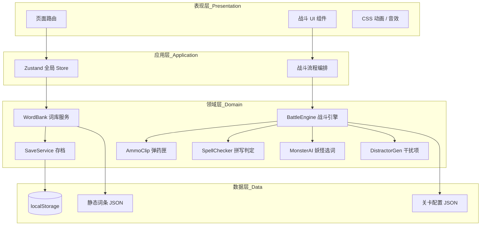
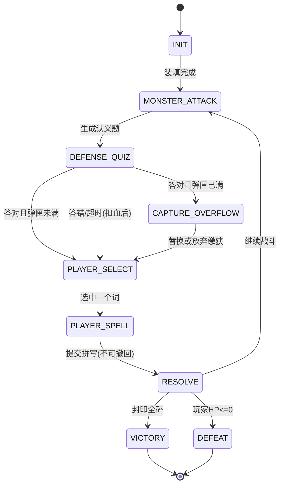
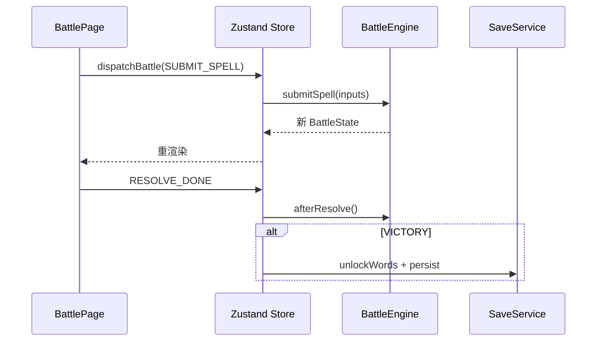
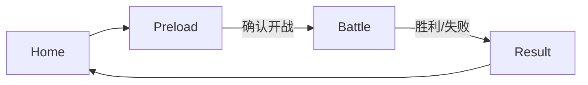
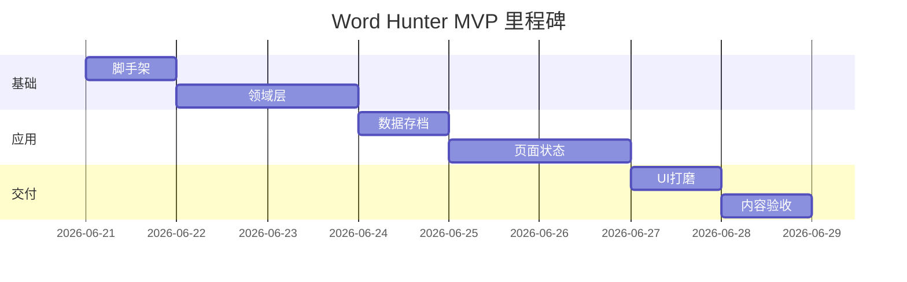

# DOC-DES-002 Word Hunter 技术方案设计文档

| 属性 | 内容 |
|------|------|
| 项目名称 | Word Hunter（单词猎人） |
| 文档版本 | v1.3 |
| 创建日期 | 2026-06-20 |
| 文档状态 | 草稿 |
| 依赖文档 | [DOC-DES-001 Word Hunter 玩法设计文档](./DOC-DES-001-WordHunter玩法设计文档.md) |
| 平台 | 网页游戏（SPA，浏览器本地运行） |

---

## 1. 文档目的

本文档将 [DOC-DES-001](./DOC-DES-001-WordHunter玩法设计文档.md) 中的玩法规则转化为 **可落地的技术架构与实现规范**，供 MVP 开发直接使用。

**已确认玩法约束（实现必须遵守）：**

- 缴获词 **2 个关键字母一次填完**，全部正确才算命中。
- 拼写错误 **本回合不允许重试**，直接进入妖怪回合；词保留在弹药匣，下回合可再选。

---

## 2. 架构总览

### 2.1 分层架构



### 2.2 设计原则

| 原则 | 说明 |
|------|------|
| **逻辑与 UI 分离** | 战斗判定全部在 `domain/`，React 组件只订阅状态、派发动作 |
| **确定性状态机** | 战斗流程用显式 `BattlePhase` 枚举驱动，避免隐式布尔标志 |
| **数据驱动** | 单词、关卡、妖怪技能均来自 JSON，不写死在组件里 |
| **纯函数优先** | `SpellChecker`、`DistractorGen` 无副作用，便于单元测试 |
| **MVP 从简** | 动画用 CSS；不引入 Phaser；不引入后端 |

---

## 3. 架构决策记录（ADR）

### ADR-001：前端单页应用，无后端

| 项 | 内容 |
|----|------|
| **决策** | MVP 采用纯前端 SPA，数据存 `localStorage` |
| **理由** | 1 人 + AI 快速验证玩法；无账号/联机需求 |
| **代价** | 无法跨设备同步；词库可被用户清除 |
| **后续** | v2 可增加 Supabase / Firebase 云存档 |

### ADR-002：React + TypeScript + Vite

| 项 | 内容 |
|----|------|
| **决策** | 使用 React 18 + TypeScript 5 + Vite 6 |
| **理由** | 组件化战斗 UI、类型安全、HMR 开发体验好 |
| **代价** | 游戏特效表现力弱于游戏引擎 |
| **后续** | 特效升级可局部引入 Canvas 或 Phaser |

### ADR-003：Zustand 管理全局游戏状态

| 项 | 内容 |
|----|------|
| **决策** | 使用 Zustand 单 Store + 切片（slices） |
| **理由** | 比 Redux 轻量；比 Context 更适合高频战斗更新 |
| **代价** | 需约束 Store 更新路径，避免组件随意改状态 |

### ADR-004：战斗引擎独立于 React

| 项 | 内容 |
|----|------|
| **决策** | `BattleEngine` 为纯 TypeScript class，不依赖 React |
| **理由** | 可单测、可回放、UI 替换不影响核心逻辑 |
| **代价** | 需要一层 adapter 将引擎事件同步到 Zustand |

### ADR-005：MVP 动画使用 CSS + Web Audio

| 项 | 内容 |
|----|------|
| **决策** | 不引入 Phaser 3 |
| **理由** | 回合制以 UI 交互为主，CSS transition 足够 |
| **代价** | 复杂粒子特效需后续迭代 |

### ADR-006：词库 keySlots 静态 JSON 人工标注

| 项 | 内容 |
|----|------|
| **决策** | `data/words/*.json` 预置 `keySlots`，运行时只读取 |
| **理由** | 玩法核心依赖固定关键字母，质量优先 |
| **代价** | 新增词汇需人工维护 |

---

## 4. 技术栈

| 类别 | 选型 | 版本建议 |
|------|------|----------|
| 运行时 | 现代浏览器（Chrome / Edge / Safari） | ES2022+ |
| 框架 | React | ^18.3 |
| 语言 | TypeScript | ^5.5 |
| 构建 | Vite | ^6.0 |
| 路由 | react-router-dom | ^6.28 |
| 状态 | zustand | ^5.0 |
| 样式 | CSS Modules + CSS Variables | — |
| 测试 | Vitest + React Testing Library | ^2.0 / ^16.0 |
| 代码规范 | ESLint + Prettier | — |
| 包管理 | pnpm | ^9.0 |

**不引入：** Redux、Phaser、Tailwind（MVP 用 CSS Modules 即可）、后端框架。

---

## 5. 项目目录结构

```
EngGame/
├── docs/
│   └── 02-方案设计/
│       ├── DOC-DES-001-WordHunter玩法设计文档.md
│       └── DOC-DES-002-WordHunter技术方案设计文档.md
├── public/
│   └── assets/
│       ├── monsters/          # 妖怪立绘 SVG/PNG
│       ├── sfx/               # 音效（可选 MVP）
│       └── ui/                # 通用 UI 素材
├── src/
│   ├── main.tsx
│   ├── App.tsx
│   ├── router.tsx
│   ├── data/
│   │   ├── words/
│   │   │   ├── starter-100.json    # 初始 100 词
│   │   │   └── levels/
│   │   │       ├── level-01.json   # 第 1 关 10 主题词
│   │   │       └── ...
│   │   └── levels/
│   │       ├── level-01.json       # 关卡元数据 + 妖怪配置
│   │       └── ...
│   ├── domain/
│   │   ├── battle/
│   │   │   ├── BattleEngine.ts
│   │   │   ├── BattlePhase.ts
│   │   │   ├── battleTypes.ts
│   │   │   └── battleConfig.ts
│   │   ├── clip/
│   │   │   └── AmmoClip.ts
│   │   ├── spell/
│   │   │   ├── SpellChecker.ts
│   │   │   └── spellMask.ts
│   │   ├── monster/
│   │   │   └── MonsterAI.ts
│   │   ├── quiz/
│   │   │   └── DistractorGen.ts
│   │   ├── element/
│   │   │   ├── Element.ts
│   │   │   └── DamageResolver.ts
│   │   ├── loadout/
│   │   │   └── AutoLoadout.ts
│   │   └── word/
│   │       └── WordBank.ts
│   ├── services/
│   │   └── SaveService.ts
│   ├── store/
│   │   ├── gameStore.ts
│   │   ├── battleSlice.ts
│   │   ├── progressSlice.ts
│   │   └── wordSlice.ts
│   ├── pages/
│   │   ├── HomePage.tsx
│   │   ├── WordBankPage.tsx
│   │   ├── PreloadPage.tsx
│   │   ├── BattlePage.tsx
│   │   └── ResultPage.tsx
│   ├── components/
│   │   ├── battle/
│   │   │   ├── MonsterPanel.tsx
│   │   │   ├── SealBar.tsx
│   │   │   ├── PlayerHP.tsx
│   │   │   ├── DefenseQuiz.tsx
│   │   │   ├── AmmoClipBar.tsx
│   │   │   ├── SpellInput.tsx
│   │   │   ├── CaptureReplaceModal.tsx
│   │   │   ├── CountdownBar.tsx
│   │   │   ├── ComboBadge.tsx
│   │   │   └── ElementBadge.tsx
│   │   ├── word/
│   │   │   └── WordCard.tsx
│   │   └── common/
│   │       ├── Button.tsx
│   │       └── Modal.tsx
│   ├── hooks/
│   │   ├── useBattle.ts
│   │   ├── useCountdown.ts
│   │   └── useGameSave.ts
│   ├── styles/
│   │   ├── tokens.css           # 设计变量
│   │   └── global.css
│   └── utils/
│       ├── shuffle.ts
│       └── id.ts
├── tests/
│   ├── domain/
│   │   ├── BattleEngine.test.ts
│   │   ├── SpellChecker.test.ts
│   │   ├── AmmoClip.test.ts
│   │   └── DistractorGen.test.ts
│   └── ...
├── index.html
├── package.json
├── tsconfig.json
├── vite.config.ts
└── vitest.config.ts
```

---

## 6. 核心数据模型

### 6.1 词条（WordEntry）

```typescript
/** 词性 → 五行映射 */
export type PartOfSpeech = 'noun' | 'verb' | 'adjective' | 'adverb' | 'other';

export type Element = 'metal' | 'wood' | 'water' | 'fire' | 'earth';

/** 静态词库中的词条定义 */
export interface WordEntry {
  id: string;
  word: string;
  meaning: string;
  phonetic?: string;
  theme?: string;
  difficulty?: 1 | 2 | 3;
  /** 词性；五行色由词性推导，仅用于 UI */
  partOfSpeech: PartOfSpeech;
  keySlots: {
    own: number[];       // 长度 1，0-based 索引
    captured: number[];  // 长度 1 或 2（短词降级）
  };
  keySlotHint?: string;
}
```

### 6.1.1 词性 → 五行（Element.ts）

```typescript
export const POS_TO_ELEMENT: Record<PartOfSpeech, Element> = {
  noun: 'metal',       // 金
  verb: 'fire',        // 火
  adjective: 'water',  // 水
  adverb: 'wood',      // 木
  other: 'earth',      // 土
};

export const ELEMENT_LABEL: Record<Element, string> = {
  metal: '金',
  wood: '木',
  water: '水',
  fire: '火',
  earth: '土',
};

export function getElementFromWord(entry: WordEntry): Element {
  return POS_TO_ELEMENT[entry.partOfSpeech];
}
```

### 6.2 关卡配置（LevelConfig）

```typescript
export interface MonsterSkill {
  type: 'damage_reduction' | 'burn' | 'shorter_timer' | 'blur_options' | 'image_attack';
  value?: number;
}

export interface LevelConfig {
  id: number;
  name: string;
  monsterName: string;
  monsterAsset: string;
  /** 妖怪词性属性（战斗属性） */
  monsterPartOfSpeech: PartOfSpeech;
  themeWordIds: string[];   // 本关 10 个主题词 id
  isTutorialLevel?: boolean; // 第 1-2 关：伤害减半等教学加成
  damageMultiplier?: number; // 教学关 0.5
  timerSeconds: number;
  skills: MonsterSkill[];
  attackPoolWeights: {
    theme: number;   // 0.7
    learned: number; // 0.3
  };
}
```

### 6.3 弹药匣条目（ClipSlot）

```typescript
export type ClipWordSource = 'owned' | 'captured';

/** 战前预填来源标记（仅 owned 预填词使用） */
export type PrefillTag = 'recent' | 'recommended';

export interface ClipSlot {
  wordId: string;
  source: ClipWordSource;
  /** 战前预填时：recent=最近学习50%，recommended=系统推荐50% */
  prefillTag?: PrefillTag;
  /** 缴获入匣时的战斗回合号，用于 UI 标记 */
  capturedAtTurn?: number;
}
```

### 6.4 玩家进度（PlayerProgress）

```typescript
export interface PlayerProgress {
  version: number;
  unlockedLevel: number;
  wordMastery: Record<string, WordMastery>;
  stats: {
    totalBattlesWon: number;
    totalWordsLearned: number;
    bestCombo: number;
  };
}

export type LearnedVia = 'starter' | 'victory' | 'captured';

export interface WordMastery {
  wordId: string;
  /** 0-100，胜利入库 + 复习提升 */
  familiarity: number;
  /** 首次入库来源，用于最近学习词排序 */
  learnedVia: LearnedVia;
  firstLearnedAt: string; // ISO date
  lastReviewedAt?: string;
}
```

### 6.5 存档根结构（SaveData）

```typescript
export interface SaveData {
  version: 1;
  progress: PlayerProgress;
  /** 玩家大词库中已拥有的 wordId 列表 */
  ownedWordIds: string[];
  updatedAt: string;
}
```

---

## 7. 战斗状态机

### 7.1 阶段枚举（BattlePhase）

```typescript
export enum BattlePhase {
  /** 战斗初始化，装填弹药匣 */
  INIT = 'INIT',
  /** 妖怪选词，展示防御题 */
  MONSTER_ATTACK = 'MONSTER_ATTACK',
  /** 玩家答防御题（认释义） */
  DEFENSE_QUIZ = 'DEFENSE_QUIZ',
  /** 防御答对且弹药匣满，等待玩家选择替换或放弃 */
  CAPTURE_OVERFLOW = 'CAPTURE_OVERFLOW',
  /** 玩家选择进攻词 */
  PLAYER_SELECT = 'PLAYER_SELECT',
  /** 玩家拼写中（1 空或 2 空） */
  PLAYER_SPELL = 'PLAYER_SPELL',
  /** 回合结算动画（命中/未中/受伤） */
  RESOLVE = 'RESOLVE',
  /** 战斗胜利 */
  VICTORY = 'VICTORY',
  /** 战斗失败 */
  DEFEAT = 'DEFEAT',
}
```

### 7.2 状态流转图



### 7.3 战斗运行时状态（BattleState）

```typescript
export interface BattleState {
  phase: BattlePhase;
  levelId: number;
  turn: number;

  playerHp: number;
  playerMaxHp: number;
  sealsBroken: number;
  sealsTotal: number;
  /** 封印累积伤害余数（0~1） */
  sealDamageBuffer: number;
  /** 妖怪词性属性 */
  monsterPartOfSpeech: PartOfSpeech;

  combo: number;
  isEnraged: boolean;

  /** 当前妖怪扔出的词 */
  attackWordId: string | null;
  /** 当前防御题选项 */
  defenseOptions: DefenseOption[] | null;

  /** 本轮缴获待入匣的词（overflow 前暂存） */
  pendingCapture: ClipSlot | null;

  /** 当前选中的进攻词 */
  selectedWordId: string | null;
  /** 拼写掩码后的显示与槽位 */
  spellPrompt: SpellPrompt | null;

  timerSeconds: number;
  timerRemaining: number;

  clip: ClipSlot[];

  /** 本战已击破封印记录，用于统计 */
  hitLog: string[];
  /** 本战玩家受伤记录 */
  damageLog: number[];
  /** 本战最后一次命中的伤害结算（UI 反馈用） */
  lastHitResult: HitResult | null;
}

export type PosAffinity = 'synergy' | 'resist' | 'neutral';

export interface HitResult {
  wordPos: PartOfSpeech;
  monsterPos: PartOfSpeech;
  affinity: PosAffinity;
  damageMultiplier: number;
  rawDamage: number;
  sealsBrokenThisHit: number;
}

export interface DefenseOption {
  id: string;
  text: string;
  isCorrect: boolean;
}

export interface SpellPrompt {
  wordId: string;
  source: ClipWordSource;
  /** 如 "a p p _ e" 的字符数组，'_' 表示空 */
  displayChars: string[];
  /** 需要玩家输入的槽位索引 */
  blankIndices: number[];
  /** 是否已提交（提交后不可重试） */
  submitted: boolean;
}
```

### 7.4 关键流程伪代码

**防御答对 → 缴获**

```typescript
function onDefenseCorrect(state: BattleState): BattleState {
  const captured: ClipSlot = {
    wordId: state.attackWordId!,
    source: 'captured',
    capturedAtTurn: state.turn,
  };

  if (state.clip.length >= 10) {
    return { ...state, phase: BattlePhase.CAPTURE_OVERFLOW, pendingCapture: captured };
  }

  return {
    ...state,
    phase: BattlePhase.PLAYER_SELECT,
    clip: [...state.clip, captured],
    pendingCapture: null,
    combo: state.combo + 1,
  };
}
```

**拼写提交（一次填完，拼错不重试）**

```typescript
function onSpellSubmit(state: BattleState, inputs: Record<number, string>): BattleState {
  if (state.spellPrompt?.submitted) {
    throw new Error('本回合已提交，不可重试');
  }

  const result = SpellChecker.validate(state.spellPrompt!, inputs);

  const next: BattleState = {
    ...state,
    spellPrompt: { ...state.spellPrompt!, submitted: true },
    phase: BattlePhase.RESOLVE,
  };

  if (result.correct) {
    const hit = DamageResolver.resolve(wordEntry, state.monsterPartOfSpeech);
    const applied = DamageResolver.applyToSeals(
      state.sealsBroken,
      state.sealDamageBuffer,
      hit.rawDamage,
    );
    next.sealsBroken = applied.sealsBroken;
    next.sealDamageBuffer = applied.buffer;
    next.lastHitResult = hit;
    next.combo += 1;
    next.hitLog = [...next.hitLog, state.selectedWordId!];
  } else {
    // 拼错：不击破封印，combo 归零
    next.combo = 0;
  }

  return next;
}

function afterResolve(state: BattleState): BattleState {
  if (state.sealsBroken >= state.sealsTotal) {
    return { ...state, phase: BattlePhase.VICTORY };
  }
  if (state.playerHp <= 0) {
    return { ...state, phase: BattlePhase.DEFEAT };
  }

  const turn = state.turn + 1;
  const isEnraged = turn >= 20;

  return startMonsterAttack({ ...state, turn, isEnraged, selectedWordId: null, spellPrompt: null });
}
```

---

## 8. 领域模块设计

### 8.1 DamageResolver（词性相生相克）

```typescript
/** 相生表：妖怪词性 → 相生子弹词性（+20%） */
export const POS_SYNERGY: Partial<Record<PartOfSpeech, PartOfSpeech>> = {
  noun: 'adjective',      // 形容词修饰名词
  verb: 'adverb',         // 副词修饰动词
  adjective: 'adverb',    // 副词修饰形容词
  adverb: 'verb',         // 动词承载副词
};

export class DamageResolver {
  static readonly BASE_DAMAGE = 1.0;
  static readonly SYNERGY_MULTIPLIER = 1.2;  // 相生 +20%
  static readonly RESIST_MULTIPLIER = 0.8;   // 同词性 -20%

  static resolve(word: WordEntry, monsterPos: PartOfSpeech): HitResult {
    const wordPos = word.partOfSpeech;
    const affinity = DamageResolver.getAffinity(wordPos, monsterPos);
    const damageMultiplier =
      affinity === 'synergy' ? DamageResolver.SYNERGY_MULTIPLIER :
      affinity === 'resist'  ? DamageResolver.RESIST_MULTIPLIER :
      1.0;

    return {
      wordPos,
      monsterPos,
      affinity,
      damageMultiplier,
      rawDamage: DamageResolver.BASE_DAMAGE * damageMultiplier,
      sealsBrokenThisHit: 0,
    };
  }

  static getAffinity(wordPos: PartOfSpeech, monsterPos: PartOfSpeech): PosAffinity {
    if (wordPos === monsterPos) return 'resist';
    if (POS_SYNERGY[monsterPos] === wordPos) return 'synergy';
    return 'neutral';
  }

  /** 累积伤害制：余数保留 */
  static applyToSeals(
    sealsBroken: number,
    buffer: number,
    rawDamage: number,
  ): { sealsBroken: number; buffer: number; brokenThisHit: number } {
    let total = buffer + rawDamage;
    let brokenThisHit = 0;

    while (total >= 1.0 && sealsBroken + brokenThisHit < 10) {
      total -= 1.0;
      brokenThisHit += 1;
    }

    return {
      sealsBroken: sealsBroken + brokenThisHit,
      buffer: total,
      brokenThisHit,
    };
  }
}
```

**判定示例（妖怪 = 动词）**：

| 子弹词性 | affinity | 系数 | rawDamage |
|----------|----------|------|-----------|
| adverb | synergy | 1.2 | 1.2 |
| verb | resist | 0.8 | 0.8 |
| noun | neutral | 1.0 | 1.0 |
| adjective | neutral | 1.0 | 1.0 |

### 8.2 AmmoClip

```typescript
export class AmmoClip {
  static readonly MAX = 10;

  constructor(private slots: ClipSlot[] = []) {}

  get size(): number { return this.slots.length; }
  get isFull(): boolean { return this.slots.length >= AmmoClip.MAX; }
  get all(): readonly ClipSlot[] { return this.slots; }

  loadOwned(wordIds: string[]): void {
    if (wordIds.length > AmmoClip.MAX) throw new Error('装填超限');
    this.slots = wordIds.map((id) => ({ wordId: id, source: 'owned' }));
  }

  addCaptured(slot: ClipSlot): void {
    if (this.isFull) throw new Error('弹匣已满，需先替换');
    this.slots.push(slot);
  }

  replace(index: number, slot: ClipSlot): void {
    this.slots[index] = slot;
  }

  remove(index: number): void {
    this.slots.splice(index, 1);
  }
}
```

### 8.3 SpellChecker

```typescript
export interface SpellValidationResult {
  correct: boolean;
  wrongIndices: number[];
}

export class SpellChecker {
  /** 根据词条与来源生成拼写题 */
  static buildPrompt(entry: WordEntry, source: ClipWordSource): SpellPrompt {
    const indices = source === 'owned' ? entry.keySlots.own : entry.keySlots.captured;
    const chars = entry.word.split('');
    const displayChars = chars.map((c, i) => (indices.includes(i) ? '_' : c));

    return {
      wordId: entry.id,
      source,
      displayChars,
      blankIndices: [...indices],
      submitted: false,
    };
  }

  /** 一次校验所有空，任一错误即失败 */
  static validate(prompt: SpellPrompt, entry: WordEntry, inputs: Record<number, string>): SpellValidationResult {
    const wrongIndices: number[] = [];

    for (const idx of prompt.blankIndices) {
      const expected = entry.word[idx].toLowerCase();
      const actual = (inputs[idx] ?? '').toLowerCase();
      if (expected !== actual) wrongIndices.push(idx);
    }

    return { correct: wrongIndices.length === 0, wrongIndices };
  }
}
```

**拼写 UI 约束：**

- 所有空白输入框同时展示，玩家填完后点一次「发射」。
- 点击「发射」后 `submitted = true`，输入框 `disabled`，本回合不可再改。
- 不提供「重试」按钮。

### 8.4 MonsterAI

```typescript
export class MonsterAI {
  constructor(
    private level: LevelConfig,
    private themeWords: WordEntry[],
    private learnedWords: WordEntry[],
    private rng: () => number = Math.random,
  ) {}

  pickAttackWord(): WordEntry {
    const useTheme = this.rng() < this.level.attackPoolWeights.theme;
    const pool = useTheme ? this.themeWords : this.learnedWords;
    const idx = Math.floor(this.rng() * pool.length);
    return pool[idx];
  }

  getDamage(base = 15): number {
    let dmg = base;
    if (this.level.damageMultiplier) dmg *= this.level.damageMultiplier;
    return Math.round(dmg);
  }

  getTimerSeconds(base: number, isEnraged: boolean): number {
    let t = this.level.timerSeconds ?? base;
    if (isEnraged) t -= 2;
    return Math.max(t, 4);
  }
}
```

### 8.5 DistractorGen

```typescript
export class DistractorGen {
  static build(entry: WordEntry, pool: WordEntry[]): DefenseOption[] {
    const distractors = pool
      .filter((w) => w.id !== entry.id && w.meaning !== entry.meaning)
      .sort(() => Math.random() - 0.5)
      .slice(0, 3);

    const options: DefenseOption[] = [
      { id: 'correct', text: entry.meaning, isCorrect: true },
      ...distractors.map((d, i) => ({ id: `d${i}`, text: d.meaning, isCorrect: false })),
    ];

    return shuffle(options);
  }
}
```

### 8.6 WordBank

```typescript
export class WordBank {
  constructor(
    private entries: Map<string, WordEntry>,
    private save: SaveData,
  ) {}

  getEntry(id: string): WordEntry | undefined {
    return this.entries.get(id);
  }

  getOwnedEntries(): WordEntry[] {
    return this.save.ownedWordIds
      .map((id) => this.entries.get(id))
      .filter(Boolean) as WordEntry[];
  }

  unlockWords(wordIds: string[], via: LearnedVia): void {
    for (const id of wordIds) {
      if (!this.save.ownedWordIds.includes(id)) {
        this.save.ownedWordIds.push(id);
        this.save.progress.wordMastery[id] = {
          wordId: id,
          familiarity: 10,
          learnedVia: via,
          firstLearnedAt: new Date().toISOString(),
        };
      }
    }
    this.save.progress.stats.totalWordsLearned = this.save.ownedWordIds.length;
  }

  /** 按最近学习规则排序，供 AutoLoadout 使用 */
  getRecentLearnedWordIds(limit: number): string[] {
    const owned = this.save.ownedWordIds
      .map((id) => this.save.progress.wordMastery[id])
      .filter(Boolean) as WordMastery[];

    const viaWeight: Record<LearnedVia, number> = {
      captured: 3,
      victory: 2,
      starter: 1,
    };

    return owned
      .sort((a, b) => {
        const viaDiff = viaWeight[b.learnedVia] - viaWeight[a.learnedVia];
        if (viaDiff !== 0) return viaDiff;
        return new Date(b.firstLearnedAt).getTime() - new Date(a.firstLearnedAt).getTime();
      })
      .slice(0, limit)
      .map((m) => m.wordId);
  }
}
```

### 8.7 AutoLoadout（智能预填 5+5）

```typescript
export interface PrefillResult {
  slots: ClipSlot[];
  recentIds: string[];
  recommendedIds: string[];
}

export class AutoLoadout {
  static readonly RECENT_COUNT = 5;
  static readonly RECOMMENDED_COUNT = 5;

  static build(
    wordBank: WordBank,
    level: LevelConfig,
  ): PrefillResult {
    const used = new Set<string>();

    // --- 50%：最近学习词（缴获优先）---
    const recentCandidates = wordBank.getRecentLearnedWordIds(AutoLoadout.RECENT_COUNT * 2);
    const recentIds: string[] = [];

    for (const id of recentCandidates) {
      if (recentIds.length >= AutoLoadout.RECENT_COUNT) break;
      recentIds.push(id);
      used.add(id);
    }

    // 不足 5 个：用本关主题词补足
    for (const id of level.themeWordIds) {
      if (recentIds.length >= AutoLoadout.RECENT_COUNT) break;
      if (!used.has(id)) {
        recentIds.push(id);
        used.add(id);
      }
    }

    // --- 50%：系统推荐词 ---
    const recommendedIds: string[] = [];

    // 优先：相生词性，再本关主题词
    const monsterPos = level.monsterPartOfSpeech;
    const themeFirst = sortByPosAffinity(level.themeWordIds, monsterPos, wordBank);

    for (const id of themeFirst) {
      if (recommendedIds.length >= AutoLoadout.RECOMMENDED_COUNT) break;
      if (!used.has(id)) {
        recommendedIds.push(id);
        used.add(id);
      }
    }

    if (recommendedIds.length < AutoLoadout.RECOMMENDED_COUNT) {
      const fillers = wordBank.getMediumFamiliarityWordIds(used, AutoLoadout.RECOMMENDED_COUNT - recommendedIds.length);
      recommendedIds.push(...fillers);
      fillers.forEach((id) => used.add(id));
    }

    const slots: ClipSlot[] = [
      ...recentIds.map((wordId) => ({
        wordId,
        source: 'owned' as const,
        prefillTag: 'recent' as const,
      })),
      ...recommendedIds.map((wordId) => ({
        wordId,
        source: 'owned' as const,
        prefillTag: 'recommended' as const,
      })),
    ];

    return { slots, recentIds, recommendedIds };
  }
}
```

**规则摘要：**

| 配比 | 数量 | 选取逻辑 |
|------|------|----------|
| 最近学习 | 5 | `learnedVia` 缴获 > 通关 > 初始，同来源按 `firstLearnedAt` 倒序 |
| 系统推荐 | 5 | 本关主题词优先，去重后不足则用熟悉度 30–70 的词补足 |
| 去重 | — | 两池互不重复，合计固定 10 格 |
| 标记 | — | `prefillTag: 'recent' \| 'recommended'`，UI 预览用 |

### 8.8 BattleEngine（门面）

```typescript
export class BattleEngine {
  private state: BattleState;

  constructor(
    private level: LevelConfig,
    private wordBank: WordBank,
    private clip: AmmoClip,
    private monsterAI: MonsterAI,
  ) {
    this.state = this.createInitialState();
  }

  getState(): Readonly<BattleState> { return this.state; }

  start(): void { /* INIT → MONSTER_ATTACK */ }
  submitDefense(optionId: string): void { /* ... */ }
  resolveCaptureOverflow(action: 'replace' | 'discard', replaceIndex?: number): void { /* ... */ }
  selectAttackWord(wordId: string): void { /* → PLAYER_SPELL, build SpellPrompt */ }
  submitSpell(inputs: Record<number, string>): void { /* 一次提交，不可重试 */ }
  tickTimer(): void { /* 超时 → 等同答错 */ }
}
```

---

## 9. 状态管理（Zustand）

### 9.1 Store 切片

```typescript
// store/gameStore.ts
interface GameStore {
  // progressSlice
  save: SaveData | null;
  initGame: () => void;

  // wordSlice
  wordBank: WordBank | null;
  getWord: (id: string) => WordEntry | undefined;

  // battleSlice
  engine: BattleEngine | null;
  battle: BattleState | null;
  startBattle: (levelId: number) => void;
  dispatchBattle: (action: BattleAction) => void;
}
```

### 9.2 动作类型（BattleAction）

```typescript
export type BattleAction =
  | { type: 'SUBMIT_DEFENSE'; optionId: string }
  | { type: 'CAPTURE_REPLACE'; replaceIndex: number }
  | { type: 'CAPTURE_DISCARD' }
  | { type: 'SELECT_WORD'; wordId: string }
  | { type: 'SUBMIT_SPELL'; inputs: Record<number, string> }
  | { type: 'TIMER_EXPIRED' }
  | { type: 'RESOLVE_DONE' };
```

### 9.3 数据流



**规则：** UI 禁止直接修改 `battle` 对象；所有变更经 `dispatchBattle` → `BattleEngine` 产生新状态。

---

## 10. 路由与页面

| 路径 | 页面 | 职责 |
|------|------|------|
| `/` | HomePage | 开始 / 继续、显示关卡进度 |
| `/words` | WordBankPage | 浏览大词库、熟练度 |
| `/preload/:levelId` | PreloadPage | 展示智能预填 5+5 结果，确认后开战 |
| `/battle/:levelId` | BattlePage | 主战斗界面 |
| `/result/:levelId` | ResultPage | 胜/败结算、闪卡复习 |



### 10.1 PreloadPage（预填预览）

| 区域 | 内容 |
|------|------|
| 最近学习 5 词 | `prefillTag === 'recent'`，标签「最近学习」 |
| 系统推荐 5 词 | `prefillTag === 'recommended'`，标签「本关推荐」 |
| 操作 | 仅「开始战斗」；MVP 不可改选 |

---

## 11. 关键 UI 组件规范

### 11.1 SpellInput（拼写输入）

| 要求 | 实现 |
|------|------|
| 多空白同时显示 | `blankIndices.map` 渲染 input |
| 一次提交 | 单一「发射」按钮 |
| 拼错不重试 | 提交后 `disabled={prompt.submitted}` |
| 2 空一次填完 | 校验时遍历全部 `blankIndices` |
| 键盘支持 | 空白间 Tab 切换；Enter 提交 |
| 视觉反馈 | 错误时抖动动画，然后进入 RESOLVE |

### 11.2 CaptureReplaceModal

- 触发：`phase === CAPTURE_OVERFLOW`
- 展示：待缴获词 + 当前弹匣 10 格
- 操作：点选一格替换 / 放弃缴获
- 完成后进入 `PLAYER_SELECT`

### 11.4 PosAffinityBadge（词性 / 五行徽章）

| 位置 | 展示 |
|------|------|
| 妖怪面板 | **词性徽章**（名/动/形/副）+ 五行配色 |
| 弹药匣词条 | 词性缩写 + 五行色点 |
| 相生命中 | 「相生 +20%」高亮特效 |
| 同词性命中 | 「同词性 -20%」黯淡特效 |
| 其他命中 | 正常碎裂 |

```typescript
// 五行 UI 色值
export const ELEMENT_COLOR: Record<Element, string> = {
  metal: '#9aa0a6',
  wood:  '#34a853',
  water: '#4285f4',
  fire:  '#ea4335',
  earth: '#fbbc04',
};
```

### 11.5 CountdownBar

- `useCountdown` hook 驱动 `timerRemaining`
- 归零触发 `TIMER_EXPIRED` → 防御视同答错
- 狂暴时读 `BattleState.isEnraged` 缩短上限

---

## 12. 本地存档（SaveService）

### 12.1 存储键

```typescript
const SAVE_KEY = 'word-hunter-save-v1';
```

### 12.2 读写策略

| 时机 | 操作 |
|------|------|
| 应用启动 | `load()`，无存档则 `createNewSave(starter100)` |
| 战斗胜利 | `unlockWords` 后 `persist()` |
| 页面 `beforeunload` | 防抖 `persist()` |
| 设置页（v2） | 清除存档 |

### 12.3 版本迁移

```typescript
function migrate(raw: unknown): SaveData {
  // v1 仅一种结构；未来 v2 在此扩展
  return raw as SaveData;
}
```

---

## 13. 静态数据组织

### 13.1 初始 100 词

`src/data/words/starter-100.json` — 数组，每项符合 `WordEntry`。

### 13.2 关卡主题词

`src/data/words/levels/level-01.json` — 10 个 `WordEntry`（可与 starter 重叠或独立）。

### 13.3 关卡元数据

`src/data/levels/level-01.json` — 符合 `LevelConfig`，`themeWordIds` 引用词 id。

### 13.4 数据加载

```typescript
// 启动时合并为 Map<string, WordEntry>
const wordIndex = new Map<string, WordEntry>();
```

---

## 14. 样式与动画

### 14.1 设计变量（tokens.css）

```css
:root {
  --color-bg: #1a1a2e;
  --color-panel: #16213e;
  --color-accent: #e94560;
  --color-success: #4ecca3;
  --color-warning: #f5a623;
  --font-main: "Microsoft YaHei", "PingFang SC", sans-serif;
  --radius: 12px;
  --transition-fast: 150ms ease;
}
```

### 14.2 MVP 动画清单

| 事件 | 动画 |
|------|------|
| 封印破碎 | CSS scale + opacity |
| 缴获入匣 | translate 飞入动画 |
| 拼写错误 | shake keyframes |
| Combo | 数字弹跳 |
| 胜利 | 碎片散落（CSS stagger） |

---

## 15. 实现阶段（里程碑）

### Phase 0：项目脚手架（0.5 天）

- [ ] `pnpm create vite` + React TS
- [ ] 配置 ESLint / Prettier / Vitest
- [ ] 目录结构、路由、tokens.css

### Phase 1：领域层（1.5 天）

- [ ] `WordEntry` / `LevelConfig` 类型
- [ ] `DamageResolver` + `Element.ts` + 测试
- [ ] `AmmoClip` + 单元测试
- [ ] `SpellChecker` + 测试（含 2 空一次填完、拼错判定）
- [ ] `DistractorGen` + 测试
- [ ] `MonsterAI` + 测试
- [ ] `BattleEngine` 状态机 + 集成测试（完整一场战斗）

### Phase 2：数据与存档（0.5 天）

- [ ] starter-100.json 占位（可先 20 词）
- [ ] level-01 ~ 05 配置
- [ ] `AutoLoadout` + 测试（5+5、去重、不足补足）
- [ ] `SaveService` + `WordBank`（含 `learnedVia`）

### Phase 3：状态与页面（1.5 天）

- [ ] Zustand store + battleSlice
- [ ] HomePage / PreloadPage / BattlePage / ResultPage
- [ ] `SpellInput`（提交后禁用，无重试）
- [ ] `CaptureReplaceModal`

### Phase 4：战斗 UI 打磨（1 天）

- [ ] 妖怪、封印条（含累积伤害裂纹态）、弹药匣、倒计时、Combo
- [ ] 词性相生徽章、相生/同词性伤害 UI 反馈
- [ ] CSS 动画与基础音效（可选）
- [ ] 胜利闪卡流程

### Phase 5：内容填充与验收（1 天）

- [ ] 补全 150 词 keySlots 人工标注
- [ ] 按 DOC-DES-001 验收标准 AC-01 ~ AC-10 走查
- [ ] 修正数值（伤害、倒计时、狂暴）

**预估 MVP 总工期：约 5–6 天（1 人 + AI）**



---

## 16. 测试策略

### 16.1 单元测试（Vitest）

| 模块 | 重点用例 |
|------|----------|
| SpellChecker | 1 空正确/错误；2 空全对/缺一错/全错；提交后不可二次校验 |
| DamageResolver | 相生 ×1.2；同词性 ×0.8；其他 ×1.0；`POS_SYNERGY` 表；累积余数 |
| AutoLoadout | 5 最近 + 5 推荐；推荐侧倾向 **相生词性** |
| AmmoClip | 预填 10、缴获、满匣替换、移除 |
| BattleEngine | 防御对→缴获；拼错不重试；预填 10 格开战 |
| DistractorGen | 4 选项含 1 正确、无重复 |

### 16.2 组件测试（RTL）

- `SpellInput`：提交后输入框 disabled
- `CaptureReplaceModal`：替换后 `pendingCapture` 入匣

### 16.3 手动测试清单

- 开战前 PreloadPage 展示 5+5 预填，确认后进入战斗
- 第 1 关最近学习不足 5 时，用本关主题词补足
- 弹匣满时缴获流程
- 刷新页面进度保留
- 移动端竖屏布局可用（响应式）

---

## 17. 非功能需求

| 类别 | 目标 |
|------|------|
| 性能 | 首屏 < 2s（本地静态资源） |
| 包体 | 首包 < 500KB（gzip，不含大图） |
| 兼容 | Chrome / Edge 最近 2 版；Safari 16+ |
| 可访问性 | 拼写 input 有 `aria-label`；按钮可键盘操作 |
| 离线 | Service Worker 为 v2；MVP 仅 localStorage |

---

## 18. 风险与缓解

| 风险 | 影响 | 缓解 |
|------|------|------|
| 150 词 keySlots 标注耗时 | 阻塞内容 | 先 20 词打通全流程，并行补全 |
| 战斗状态机边界 bug | 玩法错乱 | BattleEngine 集成测试覆盖主路径 |
| 拼写 UX 过难 | 流失 | 短词降级、keySlotHint 提示（v2） |
| context7 / 文档版本漂移 | 实现偏差 | 以本文档与 DOC-DES-001 为唯一真相源 |

---

## 19. 验收映射（技术侧）

| 玩法 AC | 技术实现验证点 |
|---------|----------------|
| AC-02 | `AutoLoadout.build()` 返回 10 格；`recentIds` 5 个 |
| AC-05b | `getAffinity(adverb, verb) === 'synergy'`；`rawDamage === 1.2` |
| AC-05c | `getAffinity(verb, verb) === 'resist'`；`rawDamage === 0.8` |
| AC-05d | `getAffinity(noun, verb) === 'neutral'`；`rawDamage === 1.0` |
| AC-03 | `onDefenseCorrect` + `ClipSlot.source === 'captured'` |
| AC-04 | `phase === CAPTURE_OVERFLOW` + Modal |
| AC-06 | `SpellChecker.validate` 2 空全对 |
| AC-07 | `spellPrompt.submitted === true` 后无重试入口；`afterResolve` 不回到 PLAYER_SPELL |
| AC-08 | `VICTORY` → `WordBank.unlockWords(themeWordIds, 'victory')` |
| AC-10 | `SaveService.load()` 恢复 `ownedWordIds` |

---

## 20. 版本记录

| 版本 | 日期 | 变更说明 |
|------|------|----------|
| v1.0 | 2026-06-20 | 初稿：架构、状态机、模块、Store、目录、里程碑、测试策略 |
| v1.1 | 2026-06-20 | 战前装填改为 AutoLoadout 智能预填 5+5；PreloadPage 替代 LoadoutPage；新增 `learnedVia` / `prefillTag` |
| v1.2 | 2026-06-20 | 五行属性：`Element` / `DamageResolver`；词性映射；同属性减伤 20%；累积封印伤害 |
| v1.3 | 2026-06-20 | 伤害改为词性相生相克（`POS_SYNERGY`）；相生 +20%；妖怪属性改为 `monsterPartOfSpeech` |

---

## 附录 A：BattleEngine 集成测试示例

```typescript
describe('BattleEngine spell rules', () => {
  it('拼错后本回合不可重试，下回合可再选', () => {
    const engine = createTestEngine();
    engine.start();
    // ... 进入 PLAYER_SPELL
    engine.selectAttackWord('word_apple');
    engine.submitSpell({ 3: 'x' }); // 错误字母
    expect(engine.getState().spellPrompt?.submitted).toBe(true);
    expect(engine.getState().sealsBroken).toBe(0);

    engine.dispatchResolveDone();
    // 进入下一妖怪回合
    expect(engine.getState().phase).toBe(BattlePhase.MONSTER_ATTACK);

    // 再进入玩家回合，同一词可再选
    // ...
  });

  it('缴获词 2 空必须一次全对', () => {
    const engine = createTestEngineWithCapturedWord('word_monster');
    engine.selectAttackWord('word_monster');
    engine.submitSpell({ 1: 'o', 4: 'x' }); // 第二空错
    expect(engine.getState().sealsBroken).toBe(0);
  });
});
```

## 附录 B：相关文档

- [DOC-DES-001 Word Hunter 玩法设计文档](./DOC-DES-001-WordHunter玩法设计文档.md)
