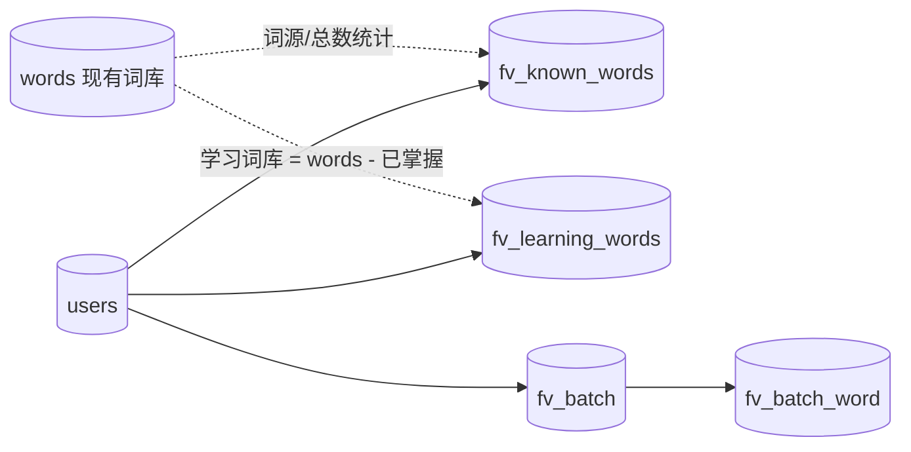

# DOC-DES-001 自由背单词数据字典

> 关联文档：技术方案见 [DOC-DEV-003 自由背单词技术方案](../3.开发/DOC-DEV-003-自由背单词技术方案.md)。

## 1. 数据库概述

- **数据库**：SQLite（`server/data/app.db`），通过 `node:sqlite` `DatabaseSync` 访问。
- **建表位置**：`server/src/db.ts`（`APP_SCHEMA` 追加 `fv_*` 表）。
- **命名约定**：自由背单词模块表统一前缀 `fv_`（free-vocab），与现有进度表隔离。
- **时间字段**：均为毫秒级 Unix 时间戳（`INTEGER`，`Date.now()`）。
- **外键**：`PRAGMA foreign_keys = ON`，`user_id → users(id)`、`word_id → words(id)` 均 `ON DELETE CASCADE`。

## 2. 表结构说明

### 2.1 已掌握词库（fv_known_words）

存储用户已掌握的词（造句/完形素材池）：初始化保留词 + 后续通过的生词。

| 字段名 | 数据类型 | 是否为空 | 默认值 | 主键 | 外键 | 说明 |
|--------|---------|---------|--------|------|------|------|
| user_id | TEXT | NOT NULL | | ✓ | users(id) | 用户 ID |
| word | TEXT | NOT NULL | | ✓ | | 单词原形（小写） |
| pos | TEXT | NOT NULL | `'other'` | | | 词性枚举，见 §3.1 |
| source | TEXT | NOT NULL | `'init'` | | | 来源枚举，见 §3.2 |
| learned_at | INTEGER | NOT NULL | 0 | | | 掌握时刻（近因加权用） |

- 主键：`(user_id, word)`
- 索引：`idx_fv_known_user (user_id)`

### 2.2 学习词库（fv_learning_words）

存储用户当前待学/学习中的生词状态。

| 字段名 | 数据类型 | 是否为空 | 默认值 | 主键 | 外键 | 说明 |
|--------|---------|---------|--------|------|------|------|
| user_id | TEXT | NOT NULL | | ✓ | users(id) | 用户 ID |
| word | TEXT | NOT NULL | | ✓ | | 单词原形 |
| pos | TEXT | NOT NULL | `'other'` | | | 词性枚举，见 §3.1 |
| status | TEXT | NOT NULL | `'pending'` | | | 学习状态枚举，见 §3.3 |
| updated_at | INTEGER | NOT NULL | 0 | | | 最近更新时刻 |

- 主键：`(user_id, word)`
- 索引：`idx_fv_learning_user (user_id, status)`
- 说明：通过后该词从本表删除（或置 `status='passed'`），并写入 `fv_known_words`。

### 2.3 学习批次（fv_batch）

一次"AI 选词 → 背诵 → 测评"的会话，绑定一个目标句型。

| 字段名 | 数据类型 | 是否为空 | 默认值 | 主键 | 外键 | 说明 |
|--------|---------|---------|--------|------|------|------|
| id | TEXT | NOT NULL | | ✓ | | 批次 ID（UUID） |
| user_id | TEXT | NOT NULL | | | users(id) | 用户 ID |
| tier_id | TEXT | NOT NULL | | | | 词库 tier（beginner/intermediate/advanced） |
| pattern | TEXT | NOT NULL | | | | 句型代码枚举，见 §3.4 |
| status | TEXT | NOT NULL | `'active'` | | | 批次状态枚举，见 §3.5 |
| cloze_streak | INTEGER | NOT NULL | 0 | | | 连续完形全对次数（≥3 通过） |
| created_at | INTEGER | NOT NULL | | | | 创建时刻 |
| passed_at | INTEGER | NULL | | | | 通过时刻 |

- 主键：`id`
- 索引：`idx_fv_batch_user (user_id, status)`

### 2.4 批次词关联（fv_batch_word）

批次与其包含生词的多对多关联。

| 字段名 | 数据类型 | 是否为空 | 默认值 | 主键 | 外键 | 说明 |
|--------|---------|---------|--------|------|------|------|
| batch_id | TEXT | NOT NULL | | ✓ | fv_batch(id) | 批次 ID |
| word | TEXT | NOT NULL | | ✓ | | 单词原形 |
| role | TEXT | NULL | | | | 该词在句型中承担的角色，见 §3.6 |

- 主键：`(batch_id, word)`

## 3. 字段值说明（枚举）

### 3.1 词性（pos）

| 值 | 说明 |
|----|------|
| `noun` | 名词 |
| `verb` | 动词 |
| `adj` | 形容词 |
| `adv` | 副词 |
| `pronoun` | 代词（本模块新增，需从现有 `other` 中拆分标注） |
| `other` | 其他 |

### 3.2 来源（source，fv_known_words）

| 值 | 说明 |
|----|------|
| `init` | 初始化筛选保留入库 |
| `pronoun` | 系统自动种入的固定代词 |
| `learned` | 背诵批次通过后晋升 |

### 3.3 学习状态（status，fv_learning_words）

| 值 | 说明 |
|----|------|
| `pending` | 待学（尚未进入批次） |
| `learning` | 学习中（已在 active 批次） |
| `passed` | 已通过（通常随即移入已掌握词库） |

### 3.4 句型代码（pattern，fv_batch）

| 值 | 句型 | 角色槽 |
|----|------|--------|
| `SV` | 主谓 | 主语 + 谓语 |
| `SVO` | 主谓宾 | 主语 + 谓语 + 宾语 |
| `SVP` | 主系表 | 主语 + 系动词 + 表语 |
| `SVO_attr` | 主谓宾 + 定语 | 主谓宾 + 定语 |
| `SVO_adv` | 主谓宾 + 状语 | 主谓宾 + 状语 |
| `SVOC` | 主谓宾宾补 | 主谓宾 + 宾补 |

### 3.5 批次状态（status，fv_batch）

| 值 | 说明 |
|----|------|
| `active` | 学习中 |
| `passed` | 已通过（cloze_streak 达 3） |
| `abandoned` | 用户放弃 |

### 3.6 句型角色（role，fv_batch_word）

复用 `SentenceRole`：`subject`（主语）、`predicate`（谓语）、`object`（宾语）、`attributive`（定语）、`adverbial`（状语）、`complement`（补语）。

## 4. 业务规则

- 已掌握词库中固定代词（`source='pronoun'`）在初始化开始时自动种入，计入 100 总量，不参与出题与剔除。
- 初始化每轮抽 `noun/verb/adj` 各 10 个；"不认识"的词不写库，仅本轮排除，后续可复现。
- `fv_known_words` 计数 ≥ 100 时自动结束初始化。
- 同一批次 `cloze_streak >= 3` 即通过；任一完形空错则 `cloze_streak` 清零。
- 通过的生词写入 `fv_known_words`（`source='learned'`、`learned_at=now`），并从 `fv_learning_words` 移除。
- 学习词库（待学来源）为逻辑集合：词库全集 `words` − `fv_known_words`，无需单独物化整张表。

## 5. 索引与外键汇总

| 表 | 索引 / 约束 |
|----|------------|
| fv_known_words | PK(user_id, word)；idx_fv_known_user(user_id)；FK user_id |
| fv_learning_words | PK(user_id, word)；idx_fv_learning_user(user_id, status)；FK user_id |
| fv_batch | PK(id)；idx_fv_batch_user(user_id, status)；FK user_id |
| fv_batch_word | PK(batch_id, word)；FK batch_id → fv_batch(id) ON DELETE CASCADE |

## 6. 与现有表的关系

- `fv_*` 表仅依赖 `users`；与 `words` 通过 `word` 文本关联（不强制外键，避免词库重建时级联删除影响进度）。
- 分数统计的"词库总数"取所选 tier 在 `words` 中的总数。
