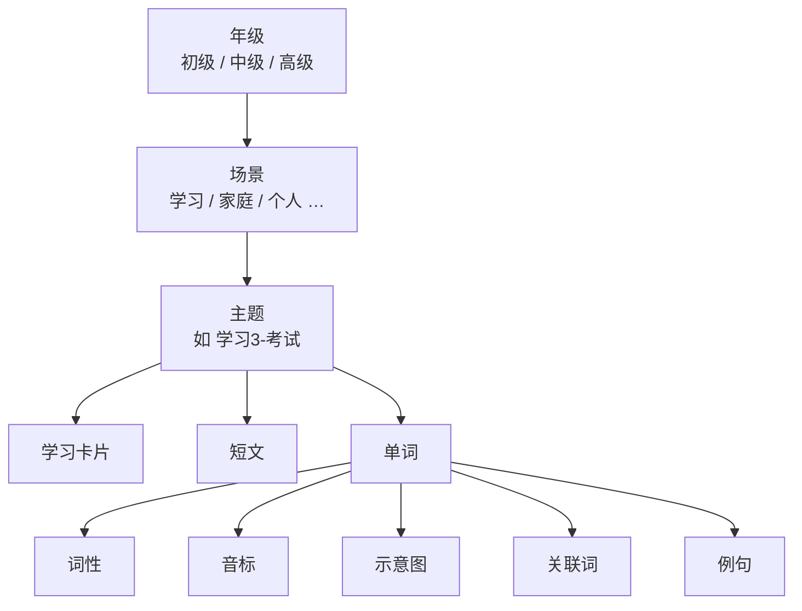

# DOC-PROD-002 术语表

> 本表为**单词记忆**模块的统一专有术语，供产品设计、开发实现与文档编写共用。  
> 旧称（大组、小组等）仅保留在「代码映射」列，新文档与界面文案一律使用本表术语。

## 1. 内容层级

单词记忆的内容按以下层级组织（自上而下）：

```text
年级
 └── 场景
      └── 主题
           ├── 学习卡片
           ├── 短文
           └── 单词（多个）
                ├── 词性
                ├── 音标
                ├── 示意图
                ├── 关联词
                └── 例句
```

### 1.1 层级关系示意



---

## 2. 术语定义

### 2.1 年级

| 项目 | 说明 |
|------|------|
| **定义** | 按难度与词量划分的最高层级，对应中考备考阶段的三档词库 |
| **取值** | **初级**、**中级**、**高级** |
| **典型规模** | 初级约 488 词；中级、高级见词库统计 |
| **旧称** | 大组、tier |
| **代码 ID** | `beginner` · `intermediate` · `advanced` |

用户在首页切换年级后，进入该年级下的场景与主题列表。

### 2.2 场景

| 项目 | 说明 |
|------|------|
| **定义** | 年级内的生活情境分类，用于把单词按「在哪用」归类 |
| **核心场景** | **学习**、**家庭**、**个人** |
| **初级年级扩展场景** | 食物、天气、运动、旅行、节日、介词、其他 |
| **旧称** | 场景主题、左侧主题名（如 DOC-DEV-002 旧版表述） |
| **代码解析** | `parseGroupTheme(title)`，如「学习3-考试」→ `学习` |

场景用于列表筛选（用户端「场景筛选」、管理后台按场景浏览主题）。

### 2.3 主题

| 项目 | 说明 |
|------|------|
| **定义** | 场景下的最小学习单元，包含一张学习卡片、一篇短文和若干单词 |
| **命名格式** | `{场景}{序号}-{主题焦点}`，如 `学习1-教室`、`家庭2-三餐` |
| **主题焦点** | 名称中 `-` 后的部分，表示该主题的具体情境（如教室、考试） |
| **单词数量** | 通常 5～6 个（初级按场景分组）；随机分组时 5～10 个 |
| **旧称** | 小组、group、场景小组 |
| **代码 / 表** | `VocabGroup`、`game_tier_groups`、`group_index` |

同一场景可拆分为多个主题，例如「学习1-教室」「学习2-图书馆」「学习3-考试」均属于**学习**场景。

### 2.4 学习卡片

| 项目 | 说明 |
|------|------|
| **定义** | 主题顶部的场景配图，将本主题内所有单词串在同一幅画面中，并带英文标签 |
| **作用** | 建立「主题情境 → 单词」的整体联想；用户端主题列表与主题详情均展示 |
| **规格** | 横版 16:9 PNG，见 [DOC-DEV-002](../3.开发/DOC-DEV-002-单词小组配图规则.md) |
| **旧称** | 小组配图、场景配图、group cover |
| **存放路径** | `public/images/vocab-groups/{年级ID}/{主题序号}.png` |

### 2.5 短文

| 项目 | 说明 |
|------|------|
| **定义** | 围绕本主题单词编写的英汉对照短段落，用于听读与语境理解 |
| **字段** | `passage_en` / `passage_zh`（库表 `game_tier_groups`） |
| **旧称** | 场景短文 |
| **音频** | 可由 TTS 生成并缓存（见 `passageAudio`） |

### 2.6 单词

| 项目 | 说明 |
|------|------|
| **定义** | 主题内的单个学习对象，是记忆、闪卡、测试的最小粒度 |
| **旧称** | 词、word |
| **代码 / 表** | `VocabWord`、`words`、`game_word_assignments` |

### 2.7 词性

| 项目 | 说明 |
|------|------|
| **定义** | 单词的语法类别 |
| **取值** | 名词、动词、形容词、副词、其他（`noun` / `verb` / `adj` / `adv` / `other`） |
| **字段** | `pos`、`posLabel` |

### 2.8 音标

| 项目 | 说明 |
|------|------|
| **定义** | 单词读音的国际音标标注，辅助发音与听读 |
| **字段** | `phonetic` |

### 2.9 示意图

| 项目 | 说明 |
|------|------|
| **定义** | 单词在**学习卡片**中对应的视觉元素：标签 + 引导线所指向的具体物体或符号 |
| **与 learning card 关系** | 学习卡片是主题级整图；示意图是其中**单个单词**的可视化锚点 |
| **抽象词** | 须具象化（如 `happy` → 笑脸，`because` → 因果箭头），规则见 DOC-DEV-002 §4.5 |
| **实现状态** | 随主题学习卡片一并生成；独立单词插图字段为后续可选扩展 |

### 2.10 关联词

| 项目 | 说明 |
|------|------|
| **定义** | 与目标词相关的扩展词汇，按类型组织展示 |
| **类型优先级** | 词形变化 → 固定搭配 → 同主题词 → 易混词（见 [DOC-PROD-001](DOC-PROD-001-单词生成规则.md) §4） |
| **字段** | `similar1` / `similar2` / `similar3`（待拆分为结构化字段） |
| **旧称** | 关联单词、similar words |

### 2.11 例句

| 项目 | 说明 |
|------|------|
| **定义** | 体现目标词某一常用义项的英汉对照例句 |
| **原则** | 短、熟、真、一义一句（见 DOC-PROD-001 §3） |
| **字段** | `example_en` / `example_zh`（及可选第二例句字段） |
| **注意** | 与「例句**情境**」（校园、家庭等选材偏好）不同，后者见 DOC-PROD-001 §3.4 |

---

## 3. 易混概念对照

| 统一术语 | 不要与以下概念混淆 | 区分方式 |
|----------|-------------------|----------|
| **场景**（学习/家庭/个人） | 例句情境（校园/家庭/日常） | 场景是**内容结构**；例句情境是**写例句时的选材偏好** |
| **主题** | 场景 | 主题是带序号的学习单元（如学习3-考试）；场景是上一级分类（学习） |
| **学习卡片** | 示意图 | 学习卡片是主题整图；示意图是图中某一单词的视觉对应 |
| **年级** | 场景 | 年级是难度档（初/中/高）；场景是生活情境分类 |

---

## 4. 代码与数据库映射

| 统一术语 | 前端类型 / 字段 | 数据库表 / 字段 | 说明 |
|----------|----------------|-----------------|------|
| 年级 | `VocabTier`、`tierId` | `tiers` | `id` = beginner / intermediate / advanced |
| 场景 | `parseGroupTheme(title)` | （由主题 `title` 解析） | 非独立表 |
| 主题 | `VocabGroup`、`groupIndex` | `game_tier_groups`、`game_word_assignments` | `title` 如 `学习3-考试` |
| 学习卡片 | `GroupCoverImage` | 静态文件 + `vocabGroupCovers.json` | 按 `{tierId}/{groupIndex}.png` |
| 短文 | `passageEn` / `passageZh` | `game_tier_groups.passage_en/zh` | — |
| 单词 | `VocabWord` | `words` | 经 `game_word_assignments` 归属主题 |
| 词性 | `pos` / `posLabel` | `words.pos` | — |
| 音标 | `phonetic` | `words.phonetic` | — |
| 关联词 | `similar1/2/3` | `words.similar1/2/3` | — |
| 例句 | `exampleEn` / `exampleZh` | `words.example_en/zh` | — |

---

## 5. 界面文案规范

| 位置 | 推荐文案 | 避免使用 |
|------|----------|----------|
| 年级切换 Tab | 初级 / 中级 / 高级 | 大组、tier |
| 场景筛选 | 学习、家庭、个人… | 场景主题（对外可不写「主题」二字以免与「主题」层级混淆） |
| 主题列表 | 显示主题全名（如 学习3-考试） | 小组 |
| 管理后台分组操作 | 按场景生成主题、随机生成主题 | 场景分组、自动分组（小组） |
| 主题详情 | 学习卡片、短文、单词列表 | 小组配图、场景短文 |
| 单词详情 | 词性、音标、关联词、例句 | 同词根（若实为 WordNet 同义词） |

---

## 6. 修订记录

| 版本 | 日期 | 说明 |
|------|------|------|
| v1.0 | 2026-06-20 | 初稿：统一年级 / 场景 / 主题 / 学习卡片 / 单词字段术语 |
