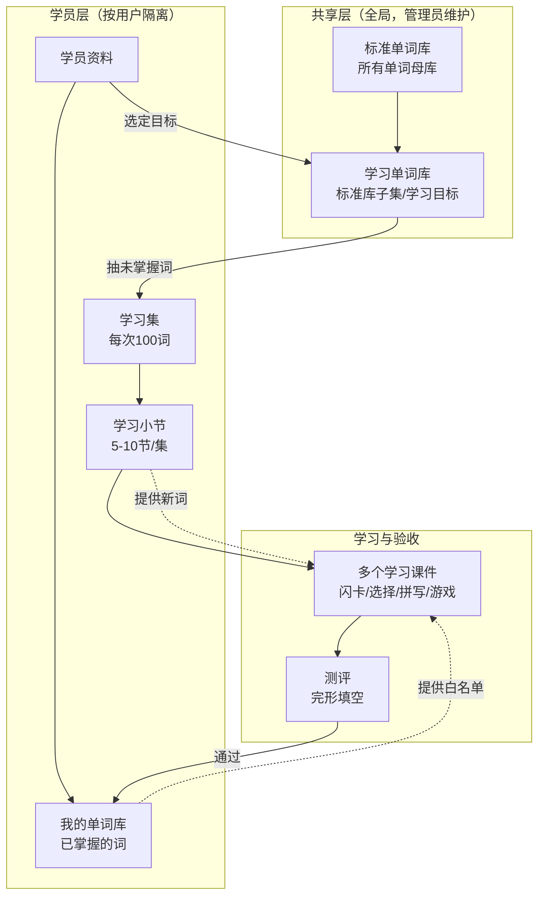
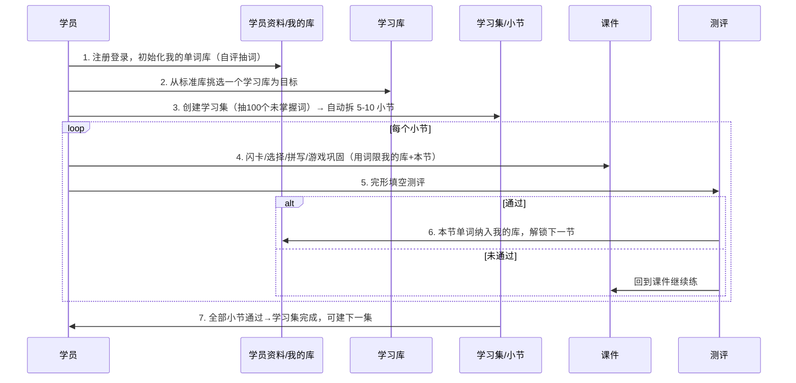
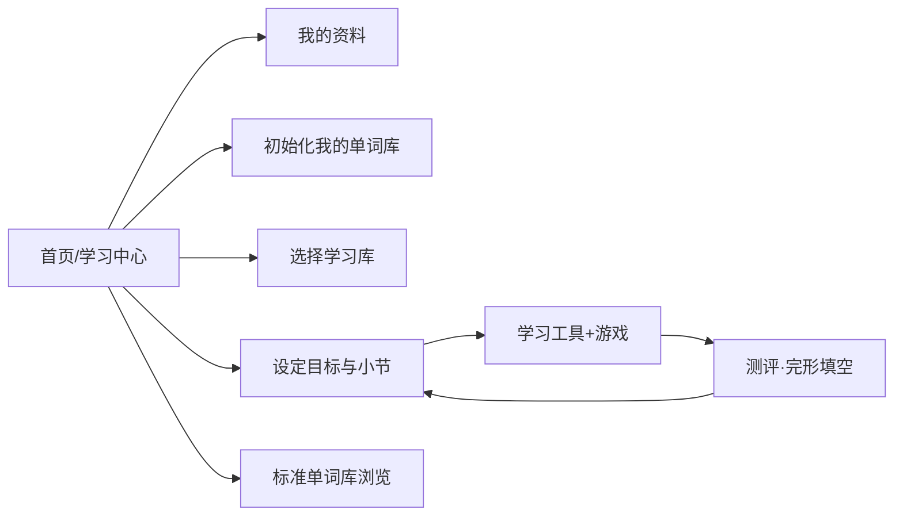

# DOC-PROD-004 学习闭环系统设计

| 项目 | 内容 |
|------|------|
| 文档编号 | DOC-PROD-004 |
| 文档名称 | 学习闭环系统设计 |
| 状态 | Draft |
| 版本 | v1.0.0 |
| 适用范围 | LearningKids 单词学习全模块重构 |

## 1. 设计目标

将原有相互独立的「单词记忆 / 介词大冒险 / 句型侦探 / 自由背单词」四个模块，统一重构为
**一条以学员为中心的单词学习闭环**：以「我的单词库」为地基，从「标准单词库」中选定一个
「学习单词库」作为目标，分批拆节、多课件巩固、完形测评验收，逐节把单词沉淀进「我的单词库」。

核心原则：

- **多用户隔离**：每个用户的学习数据（资料、我的库、学习集、进度）相互独立。
- **标准库共享**：标准单词库与学习单词库为全局共享资源，由管理员维护。
- **内容自洽约束**：任一学习课件中出现的例句、关联词、测试题用词，**只能**来自
  「我的单词库 ∪ 当前学习小节」，保证学员在已知边界内学习新词。

## 2. 概念模型

| 概念 | 定义 | 归属 |
|------|------|------|
| 标准单词库 | 全部单词母库（初级/中级/高级三档） | 共享 |
| 学习单词库 | 管理员在标准库基础上自定义的学习目标集合（按主题/考试等） | 共享 |
| 学员资料 | 用户昵称、年级、当前学习库、统计信息 | 用户 |
| 我的单词库 | 用户已熟练掌握的单词集合 | 用户 |
| 学习集 | 一次性从学习库中抽取的 100 个未掌握单词 | 用户 |
| 学习小节 | 学习集拆出的 5–10 个小节，每节 10–20 词 | 用户 |
| 学习课件 | 围绕当前小节的练习形态（闪卡、选择、拼写、游戏） | 共享逻辑 |
| 测评 | 小节验收，采用完形填空，通过后单词纳入我的库 | 用户 |

## 3. 核心流程

### 3.1 关键规则

| 环节 | 规则 |
|------|------|
| 初始化我的库 | 分词性抽样自评，标记认识的词，达到目标数（默认 100）视为完成 |
| 选学习库 | 学员同一时间锁定一个当前学习库；可切换 |
| 创建学习集 | 从当前学习库中排除「我的库」已有词，取前 100 个未掌握词（不足则取全部） |
| 拆小节 | 默认每节 15 词，节数落在 5–10 之间，按词频/序排布 |
| 小节解锁 | 第 1 节默认解锁；上一节测评通过后解锁下一节 |
| 课件用词白名单 | 我的库全部词 ∪ 当前小节词；生成例句/完形/干扰项均受此约束 |
| 测评通过判定 | 完形填空连续达标 N 次（默认 1 次全对，可配置连对阈值） |
| 纳入我的库 | 测评通过即把本节全部单词写入我的库（source=section_pass） |

## 4. UI 页面地图

| 页面 | 路径(视图) | 职责 |
|------|-----------|------|
| 学习中心 | `home` | 进度总览、各入口、当前学习集状态 |
| 我的资料 | `profile` | 昵称/年级编辑、我的库统计、学习历史 |
| 初始化学习集 | `init` | 分词性抽样自评，建立我的单词库 |
| 选择单词库 | `library` | 浏览/选定学习库为目标 |
| 设定目标和小节 | `plan` | 创建学习集、查看小节列表与解锁状态 |
| 学习工具+游戏 | `section` | 小节内多课件 Tab（闪卡/选择/拼写/扩展游戏） |
| 测评 | `assessment` | 完形填空验收 |
| 标准单词库 | `standard` | 浏览标准库三档与单词详情 |
| 管理后台 | `/admin` | 学习库 CRUD、单词维护 |

## 5. 学习课件清单

| 课件 | 形态 | 复用现状 | 用词来源 |
|------|------|----------|----------|
| 记忆卡 | 单词+释义+例句+发音 | 复用 `VocabMemoryCard/FlashCard` | 本节词 |
| 选择题 | 四选一释义 | 复用 `VocabQuizCard` | 本节词，干扰项来自白名单 |
| 拼写 | 看释义拼写 | 新增轻量组件 | 本节词 |
| 完形填空（测评） | 短文挖空选词 | 复用 `clozeGenerator`+`VocabClozeCard` | 短文用词限白名单，挖空为本节词 |
| 介词大冒险 | 扩展游戏 | 复用 `prep-game` | 独立题库（巩固用） |
| 句型侦探 | 扩展游戏 | 复用 `sentence-game` | 独立题库（巩固用） |
| Word Hunter | 扩展游戏 | 复用 `word-hunter` | 独立 |
| 征服星球 | 扩展游戏 | `conquer-planet`（战略养成 + 复用 WH 战斗引擎） | 独立入口 `/conquer`，见 DOC-PROD-005 |

## 6. 多用户与数据隔离

- 认证沿用 Cookie 会话（`sessions` 表，30 天）。
- 所有学员数据表以 `user_id` 为隔离维度，外键级联删除。
- 共享资源表（`words`/`tiers`/`learning_libraries`/`library_words`）不含 `user_id`。
- 管理员独立会话体系维护共享资源。

详细数据模型与接口见 [DOC-DEV-004 学习闭环技术方案与数据字典](../3.开发/DOC-DEV-004-学习闭环技术方案与数据字典.md)。
