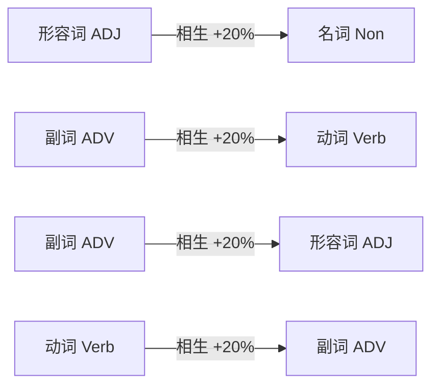
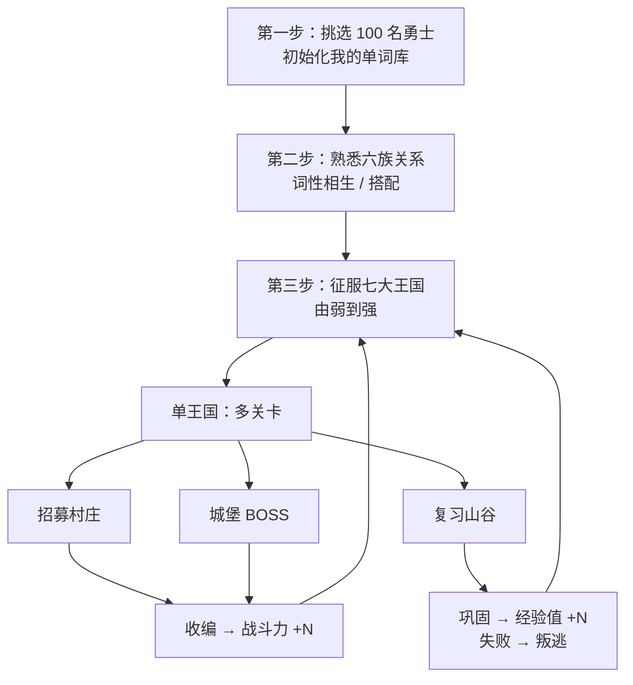
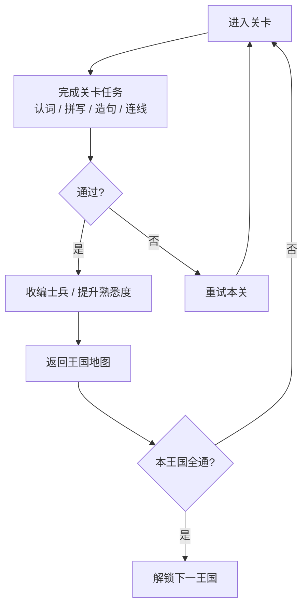
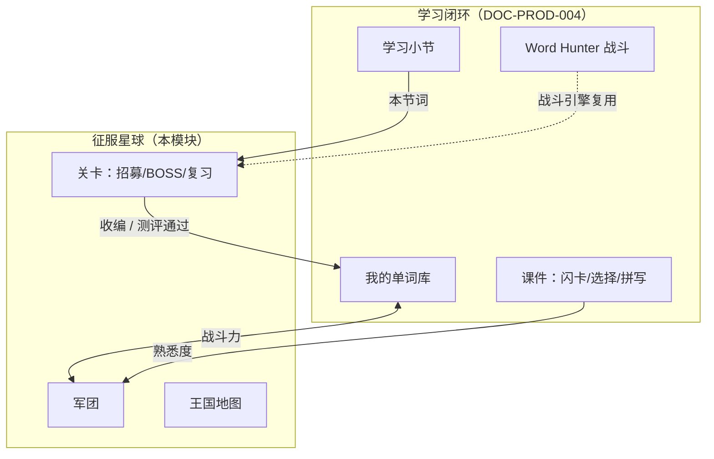
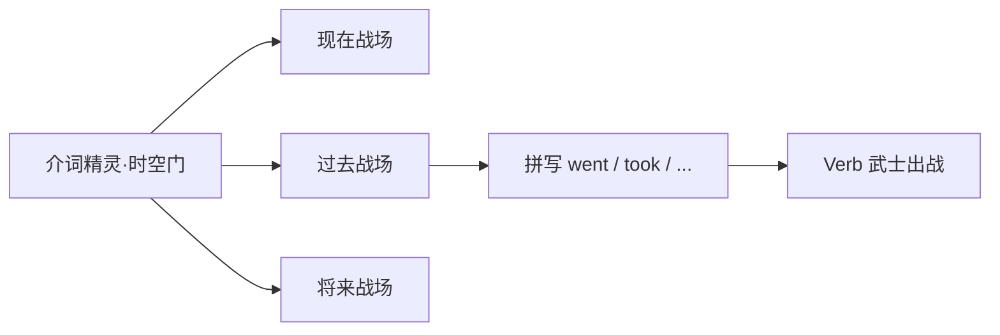
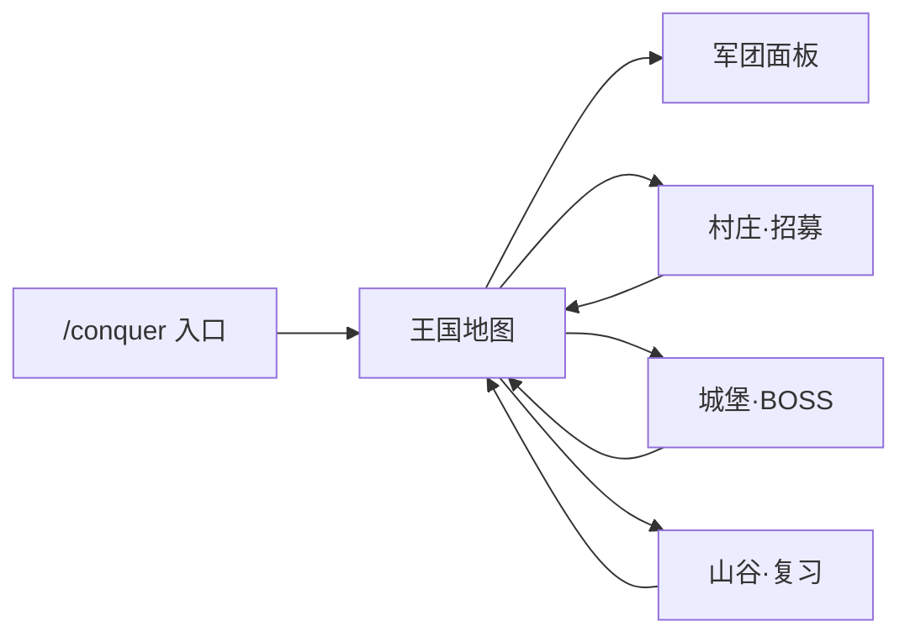

# DOC-PROD-005 征服星球玩法设计文档

| 项目 | 内容 |
|------|------|
| 文档编号 | DOC-PROD-005 |
| 文档名称 | 征服星球玩法设计文档 |
| 状态 | Draft |
| 版本 | v1.0.0 |
| 适用范围 | LearningKids 扩展游戏 · 词性军团养成 |
| 关联文档 | [DOC-PROD-004 学习闭环系统设计](DOC-PROD-004-学习闭环系统设计.md)、[DOC-PROD-006 过关游戏插件设计](DOC-PROD-006-征服星球过关游戏插件设计.md)、[EngGame/DOC-DES-001 Word Hunter 玩法设计](../EngGame/docs/02-方案设计/DOC-DES-001-WordHunter玩法设计文档.md)（战斗引擎来源）、[DOC-PROD-001 单词生成规则](DOC-PROD-001-单词生成规则.md) |
| 原型入口 | `/conquer`（`src/modules/conquer-planet/`） |

---

## 1. 项目概述

### 1.1 一句话描述

乘坐飞船来到词性星球，用**已掌握的单词**组建军团，在七大王国地图上逐关征服邪恶势力；每击败一支敌军、每招募一名村民，就把他们的「名字」收编入你的军团——**军团越大，词汇量越大**。

### 1.2 与 Word Hunter 的关系

「征服星球」是 **Word Hunter 的战略养成层升级**，而非推倒重来：

| 层次 | Word Hunter（已有） | 征服星球（新增） |
|------|---------------------|------------------|
| 战斗层 | 回合制弹药匣、拼写发射、认词闪避、封印击破 | **复用** `DamageResolver`、`SpellChecker`、`DistractorGen` |
| 养成层 | 大词库永久扩充 | **新增** 王国地图、关卡类型、军团面板、收编/叛逃 |
| 叙事层 | 单关妖怪 | **新增** 六族设定、七国征服、时空门（规划） |
| 数据层 | 本地存档 / 小节 session | **目标** 对接 `user_known_words` + `familiarity` |

### 1.3 核心价值

- **学词有动机**：单词不是题库条目，而是军团士兵；战斗力 = 军队数量，直观可感。
- **语法即策略**：词性相生相克（形容词→名词、副词→动词）直接映射战斗加成，玩着玩着就理解词性关系。
- **成长可验证**：从中考词库起步，从 100 勇士到七国通关，词汇量与游戏进度同步增长。
- **闭环可对接**：军团数据与学习闭环「我的单词库 / 熟悉度」同构，避免「玩归玩、学归学」。

### 1.4 目标用户

- 英语基础较弱的初中生（初一～初三），以**北京中考英语**备考为主。
- 已具备约 **100 个基础单词**认知储备，或已完成学习闭环「我的单词库」初始化。
- 希望在 PC 宽屏环境下，通过 5～10 分钟/关的游戏化方式巩固词汇与词性搭配。

### 1.5 设计目标

| 目标 | 说明 |
|------|------|
| 好玩 | 有征服感（收编敌兵）、有策略感（词性克制）、有危机（叛逃） |
| 好学 | 认词、拼写、造句、词性连线均围绕中考词库与词性语法 |
| 可迭代 | MVP 仅 1 王国 + 3 关卡，验证核心循环后再扩七国六关 |
| 可对接 | 正式版军团数据写入学习闭环，不另起存档体系 |

---

## 2. 世界观与六族设定

星球居民按**词性**分为六族。各族能力必须与其**真实语法功能**一致，避免「记两套规则」。

### 2.1 六族映射表

| 族 | 词性 | 角色隐喻 | 语法功能 | 战斗定位 |
|----|------|----------|----------|----------|
| **Non 族** | 名词 noun | 平民 | 事物、实体 | 数量最多（占比 50%+），基础战力 |
| **Verb 族** | 动词 verb | 武士 | 动作、行为 | 同等级战力 +50%；五种时空变形（v2） |
| **ADJ 族** | 形容词 adjective | 学者 | 修饰名词 | 面对名词时相生 +20% |
| **ADV 族** | 副词 adverb | 魔法师 | 修饰动词/形容词 | 面对动词时相生 +20% |
| **介词族** | 介词 other（prep） | 小精灵 | 表时间、位置 | **功能型 buff 卡**（控时空/位移，v2） |
| **代词族** | 代词 other（pron） | 贵族 | 指代、省略 | **指挥官 buff**（认词时间 +2s / 一次复活，v2） |

> **设计纠偏（相对原始创意）**
>
> - ADJ「治疗平民」→ 调整为「**强化名词**」：与相生表一致（形容词修饰名词）。
> - 代词「获取信任」→ 调整为「**可感知 buff**」：延长答题时间或一次复活，便于落地。
> - 介词/代词在 MVP 中**不作为主战单位**，避免战斗感弱、规则难教。

### 2.2 等级 = 音节数

每个单词的**等级**由其**音节数**决定：

- 1 音节 = Lv1，2 音节 = Lv2，以此类推。
- 长难词 = 高等级 = 高基础战力，形成「挑战难词有回报」的正反馈。
- 数据来源：词库字段 `syllables`（原型人工标注，正式版可脚本推导 + 人工抽检）。

---

## 3. 核心指标体系

游戏内两个核心指标，与学习闭环一一对应：

| 游戏指标 | 含义 | 学习闭环映射 |
|----------|------|--------------|
| **战斗力** | 军团士兵总数 | `user_known_words` 词数 |
| **经验值** | 全军熟悉程度之和 | `section_words.familiarity` 或等价熟练度字段 |

单兵经验值范围：**0～5**（★ 展示）。新收编士兵初始 familiarity = 1；初始勇士 familiarity = 3。

---

## 4. 战斗力与词性系统

### 4.1 单兵战斗力公式

```text
单兵战斗力 = 基础值(音节/等级) × 词性系数 × 克制加成

基础值     = syllables（音节数）
词性系数   = Verb 1.5，其余 1.0（Verb 比 Non 高 50%）
克制加成   = 相生 ×1.2 | 同词性 ×0.8 | 其他 ×1.0
```

**数值示例（2 音节）**

| 词 | 词性 | 基础值 | 词性系数 | 裸战力 | 对名词怪（相生/同性） |
|----|------|--------|----------|--------|------------------------|
| school | 名词 | 2 | 1.0 | 2.0 | 同性 ×0.8 → 1.6 |
| listen | 动词 | 2 | 1.5 | 3.0 | 其他 ×1.0 → 3.0 |
| happy | 形容词 | 2 | 1.0 | 2.0 | 相生 ×1.2 → 2.4 |
| quickly | 副词 | 2 | 1.0 | 2.0 | 其他 ×1.0 → 2.0 |

军团总战力 = 各士兵 `basePower` 之和（面板展示用，不含对手词性）。

### 4.2 词性相生相克（复用 Word Hunter）

实现复用 `src/modules/word-hunter/domain/element/DamageResolver.ts`，规则与 [Word Hunter DOC-DES-001 §5.5](../EngGame/docs/02-方案设计/DOC-DES-001-WordHunter玩法设计文档.md) 一致：

| 妖怪词性 | 相生（+20%）子弹词性 | 语法关系 |
|----------|----------------------|----------|
| 名词 | 形容词 | 形容词修饰名词（big apple） |
| 动词 | 副词 | 副词修饰动词（run quickly） |
| 形容词 | 副词 | 副词修饰形容词（very happy） |
| 副词 | 动词 | 动词承载副词所修饰的动作 |

判定优先级：同词性（×0.8）→ 相生（×1.2）→ 其他（×1.0）。



---

## 5. 宏观玩法循环

### 5.1 三阶段主线



### 5.2 单局关卡循环



### 5.3 与学习闭环的关系



**内容自洽约束**（正式版）：关卡中出现的例句、干扰项、造句用词，仅来自「我的单词库 ∪ 当前小节 ∪ 本关待收编词」。

---

## 6. 七大王国规划

邪恶势力占领大陆，分为 **7 个王国**，每国 **50～150 名士兵**（词）。征服顺序：**由弱到强**。

| 顺序 | 王国 | 难度 | 词库来源 | 主打机制 | MVP |
|------|------|------|----------|----------|-----|
| 1 | **微光村国** | 1 音节为主 | beginner / 中考初级 | 认词招募 + 名词 BOSS + 复习 | ✅ |
| 2 | 食物炊烟国 | 1～2 音节 | 主题：食物 | ADJ 强化 Non | — |
| 3 | 迷雾森林国 | 2 音节 | 动词为主 | ADV + VERB 搭配 | — |
| 4 | 时之沙漏国 | 2～3 音节 | 不规则动词 | **时空时态系统** | — |
| 5 | 万象集市国 | 3 音节 | 混合词性 | 六族小队词性连线 | — |
| 6 | 记忆回廊国 | 复习区 | 已学词 | 遗忘曲线 / 防叛逃 | — |
| 7 | 暗影王座国 | 高音节 | advanced / 中考高频 | 综合 BOSS | — |

每个王国含 **宫殿通道**，通道内有多关卡（见 §7）。王国通关条件：本王国全部关卡「已征服」。

---

## 7. 关卡类型设计

共 **6 种关卡类型**；MVP 实现前 **3 种**。

### 7.1 类型总览

| 类型 | 叙事 | 教学目标 | 核心交互 | MVP |
|------|------|----------|----------|-----|
| **村庄·招募** | 说服村民加入 | 词义识别 + 造句 | 4 选 1 认词 → 3 项选词造句 | ✅ |
| **城堡·BOSS** | 击败占据城堡的怪兽 | 拼写 + 词性克制 | 选武士 → 关键字母拼写 → 击破封印 | ✅ |
| **山谷·复习** | 留住走散村民 | 抗遗忘 | 认词；熟悉度 ≤2 触发 | ✅ |
| **森林·迷路** | 说服猎人 Verb 指路 | 副词 + 动词搭配 | 为动词匹配副词 | v2 |
| **遭遇·骚扰** | 迎战混合敌军 | 词性辨认 | 六族小队 + 词性连线匹配 | v2 |
| **密谈·泄密** | 士兵连续叫不出名字会离开 | 深度抗遗忘 | 连续 2 次失败 → 移出生词池 | v2 |

### 7.2 村庄·招募（recruit）

**流程**

1. 系统从「尚未入团词池」抽取 **4 名**候选村民。
2. **认词阶段**：对每个词做 4 选 1 释义；叫对名字才愿意跟随。
3. **造句训练**：完成 **3 项**选词填空造句（模板来自词库 `sentence` 字段，`___` 占位）。
4. **收编**：全部通过后，候选词写入军团；战斗力 +N，新词 familiarity = 1。

**失败**：认词或造句答错可立即重试，不扣士兵。

### 7.3 城堡·BOSS（boss）

**流程**

1. 每只 BOSS 固定一种**词性属性**（如名词「迷雾石像」）。
2. 玩家从军团选 **1 名武士**出战；界面标注「相生 +20% / 同性 -20%」。
3. **拼写发射**：复用 `SpellChecker` 关键字母挖空（自有词 1 空）；填对则按相生相克结算封印伤害。
4. **怪兽回合**：抛出一个词，4 选 1 认义闪避；失败扣 HP。
5. **胜利**：击破全部封印 → 收编 BOSS 麾下士兵（配置 `soldierWordIds`）。
6. **失败**：HP 归零可重试，**不损失已有士兵**。

**MVP 数值（第一王国·迷雾城堡）**

| 参数 | 值 |
|------|-----|
| BOSS 名称 | 迷雾石像 |
| BOSS 词性 | 名词 |
| 封印格数 | 6 |
| 玩家 HP | 100 |
| 答错伤害 | 20 |
| 收编士兵 | 5 词（school, weather, family, animal, morning） |

### 7.4 山谷·复习（review）

**触发**： familiarity ≤ **2** 的士兵进入「走散村民」队列。

**流程**

1. 逐个展示走散士兵英文，4 选 1 选释义。
2. **答对**：familiarity +1（上限 5），经验值 +1。
3. **答错**：familiarity -1。
4. **叛逃**：familiarity 降至 0 → 移出军团，战斗力 -1（对应「叫不出名字会跑掉」）。

> v2「密谈·泄密」：对同一词**连续 2 次**复习失败，直接移出生词池（更 harsh 的遗忘惩罚）。

### 7.5 森林·迷路（v2 · adv_verb）

猎人 Verb 族不愿带路。玩家须派出**与目标动词搭配的副词**（如 run → quickly），配对成功才通行。

- 干扰项：同词性其它副词。
- 教学点：副词修饰动词的固定搭配意识。

### 7.6 遭遇·骚扰（v2 · pos_match）

来袭敌人由**已知单词组合**构成（如「副词 + 动词 + 名词」短语）。玩家须组一支含**六族代表**的小队，并通过**词性连线**逐个击破。

- 对手词均来自白名单，不引入生词。
- 可复用 `prep-game` / 句型游戏的部分 UI 模式。

---

## 8. 时空时态系统（v2 规划 · 核心差异化）

介词精灵掌管**时空门**。进入特定关卡前选择战场时空：

| 时空 | 动词形态 | 示例 |
|------|----------|------|
| 现在 | 原形 / 三单 | go / goes |
| 过去 | 过去式 | went |
| 将来 | will + 原形 | will go |
| 完成 | 过去分词 | gone |

**规则**

- 在「过去」战场，Verb 武士须**拼写出过去式**（如 `went`）才能出战；叫错则本回合无法行动。
- 不规则动词 = 高级武士（战力高、召唤难）。
- 规则动词 +ed = 普通变形兵。
- 数据依赖：`wordForms`（见 [DOC-PROD-001 §4.1](DOC-PROD-001-单词生成规则.md)）。



**建议落地顺序**：第四王国「时之沙漏国」专章实现，作为 v2 第一优先功能。

---

## 9. 开局：100 名勇士

### 9.1 与学习闭环初始化对齐

| 阶段 | 游戏表现 | 系统行为 |
|------|----------|----------|
| 新用户 | 挑选最信任的 100 勇士 | 学习闭环「初始化我的单词库」：分词性抽样自评 |
| 完成后 | 100 勇士入军团 | `user_known_words` 写入，`source=init` |
| 原型/MVP | 8 名初始勇士（四族齐全） | `ensureStarter()` 本地预置，正式版改为读我的库 |

### 9.2 初始勇士（原型）

8 词：`friend, water, run, eat, big, happy, well, quickly`（涵盖 Non / Verb / ADJ / ADV）。

---

## 10. UI 页面地图



| 页面 | 职责 |
|------|------|
| 顶栏 | 品牌、重置进度（原型） |
| 王国地图 | 关卡列表、已征服标记、走散人数提示 |
| 军团面板 | 战斗力、经验值、总战力、各族人数 |
| 关卡页 | 按类型渲染招募 / BOSS / 复习 |
| 结算页 | 收编名单、叛逃名单、返回地图 |

布局遵循 [DOC-PROD-003 §2](DOC-PROD-003-产品设计规范.md)：**PC 宽屏优先**，地图区与军团面板并排（≥1280px）。

---

## 11. 数据与存档

### 11.1 原型（当前）

| 项 | 实现 |
|----|------|
| 词库 | 本地 `PLANET_WORDS`（28 词，中考高频，人工标注） |
| 存档 | `localStorage` · `conquer-planet-army-v1` |
| 入口 | `/conquer`，免登录 |

### 11.2 正式版（目标）

| 游戏概念 | 数据表/字段 |
|----------|-------------|
| 军团士兵 | `user_known_words` |
| 单兵经验 | `section_words.familiarity` 或扩展 `user_word_mastery` |
| 关卡进度 | 新增 `user_planet_progress`（user_id, kingdom_id, level_id, status） |
| 词库 | `words` + `learning_libraries` |
| 收编来源 | `source`：`init` / `recruit` / `boss` / `review` |

---

## 12. MVP 范围

### 12.1 必做（v1.0 原型 ✅）

- [x] 第一王国「微光村国」+ 3 关卡（招募 / BOSS / 复习）
- [x] 六族词性映射与军团面板（战斗力 / 经验值 / 总战力）
- [x] 战斗力公式（音节 × 词性系数 × 克制）
- [x] 复用 Word Hunter `DamageResolver` + `SpellChecker`
- [x] 收编、叛逃（熟悉度 0～5）
- [x] 本地存档 + `/conquer` 入口

### 12.2 不做（v1.0）

- 七国全开、六关全型
- 时空时态门、介词/代词 buff 卡
- 账号登录与服务端进度同步
- 联机 / 排行榜
- 自由输入造句（MVP 用选词填空）

### 12.3 v2  backlog（建议优先级）

1. **时空时态系统**（第四王国）
2. 学习闭环数据对接（军团 = 我的库）
3. 森林·迷路（ADV+VERB）
4. 遭遇·骚扰（词性连线）
5. 密谈·泄密（连续 2 次失败移出）
6. 其余五国内容与词库分层

---

## 13. 验收标准

| 编号 | 场景 | 预期结果 |
|------|------|----------|
| AC-01 | 首次打开 `/conquer` | 拥有 8 名初始勇士，军团面板显示战斗力 8 |
| AC-02 | 完成村庄招募 | 4 名新词入团，战斗力 +4，可返回地图 |
| AC-03 | BOSS 战选形容词打名词怪 | 界面显示「相生 +20%」，拼写命中伤害更高 |
| AC-04 | BOSS 战选名词打名词怪 | 显示「同性 -20%」，伤害降低 |
| AC-05 | BOSS 胜利 | 收编 5 名守军，关卡标记「已征服」 |
| AC-06 | BOSS 失败 | 可重试，已有士兵不减少 |
| AC-07 | 复习关认对走散兵 | familiarity +1，经验值增加 |
| AC-08 | 复习关连续答错至 0 | 士兵叛逃，战斗力 -1 |
| AC-09 | 刷新页面 | localStorage 恢复军团与关卡进度 |
| AC-10 | 重置进度 | 恢复 8 名初始勇士，关卡进度清空 |

---

## 14. 已确认决策

| 编号 | 决策 | 结论 |
|------|------|------|
| D-01 | 与 Word Hunter 关系 | **升级重构**：复用战斗引擎，新增战略养成层 |
| D-02 | MVP 范围 | **1 王国 + 3 关卡** |
| D-03 | 目标词库 | **北京中考**为主 |
| D-04 | 等级定义 | **音节数 = 等级** |
| D-05 | Verb vs Non 战力 | 词性系数 **1.5 vs 1.0**（+50%） |
| D-06 | 相生/同性 | 复用 Word Hunter：**+20% / -20%** |
| D-07 | ADJ 能力 | **强化名词**（非抽象「治疗」） |
| D-08 | 介词/代词 | MVP **不做主战**，v2 做 buff 卡 |
| D-09 | 造句形式 | MVP **选词填空**，非自由输入 |
| D-10 | 原型交付 | 可玩网页 **`/conquer`** |

---

## 15. 待决事项

| 编号 | 问题 | 当前默认 | 优先级 |
|------|------|----------|--------|
| OQ-01 | 正式版是否完全替代 Word Hunter 入口？ | 并存：小节内 WH + 独立征服入口 | P2 |
| OQ-02 | 100 勇士是否必须凑满才能开第一王国？ | 初始化完成即可，不强制 100 | P2 |
| OQ-03 | 叛逃词是否可再次招募？ | 可以，回「未入团词池」 | P3 |
| OQ-04 | 音节数自动推导准确率 | 脚本 + 人工抽检 | P3 |
| OQ-05 | BOSS 是否恢复 Word Hunter 完整弹药匣循环？ | MVP 轻量化；v2 对齐 WH 双回合 | P3 |

---

## 16. 版本记录

| 版本 | 日期 | 变更说明 |
|------|------|----------|
| v1.0.0 | 2026-06-21 | 初稿：整合创意讨论、原型实现（`/conquer`）、与 Word Hunter / 学习闭环关系、七国六关规划及 MVP 范围 |

---

## 附录 A：原型文件索引

| 路径 | 说明 |
|------|------|
| `src/modules/conquer-planet/ConquerPlanetPrototype.tsx` | 模块入口 |
| `src/modules/conquer-planet/data/words.ts` | 28 词本地词库 |
| `src/modules/conquer-planet/data/levels.ts` | 第一王国关卡配置 |
| `src/modules/conquer-planet/domain/power.ts` | 战斗力公式 |
| `src/modules/conquer-planet/state/useArmyStore.ts` | 军团状态与 localStorage |
| `src/modules/conquer-planet/views/*` | 地图 / 招募 / BOSS / 复习视图 |
| `src/main.tsx` | `/conquer` 路由 |

## 附录 B：关键词表

| 术语 | 含义 |
|------|------|
| 战斗力 | 军团士兵总数，对应我的单词库词数 |
| 经验值 | 全军 familiarity 之和 |
| 收编 | 新词写入军团 / 我的单词库 |
| 叛逃 | familiarity 归零，移出军团 |
| 相生 | 子弹词性修饰妖怪词性，伤害 ×1.2 |
| 同性抵抗 | 子弹与妖怪同词性，伤害 ×0.8 |
| 时空门 | 介词精灵控制的时态战场（v2） |
| 走散村民 | familiarity ≤ 2 需复习的士兵 |
