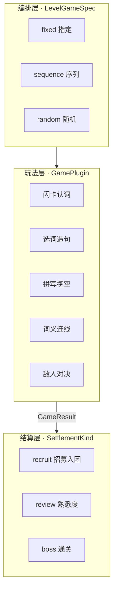
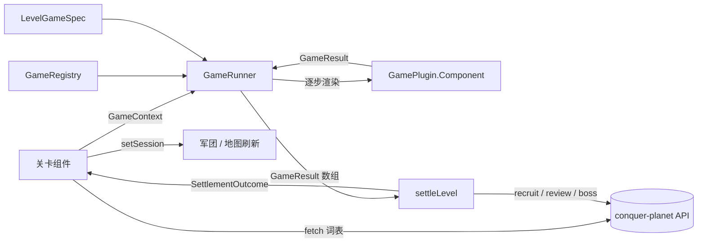
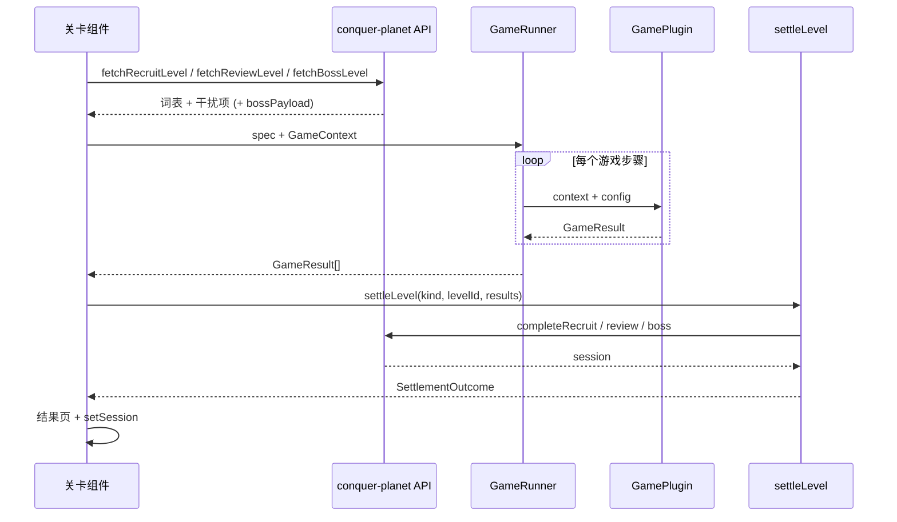

# DOC-PROD-006 征服星球过关游戏插件设计

| 项目 | 内容 |
|------|------|
| 文档编号 | DOC-PROD-006 |
| 文档名称 | 征服星球过关游戏插件设计 |
| 状态 | Draft |
| 版本 | v1.0.0 |
| 适用范围 | 征服星球（`src/modules/conquer-planet/games/`）关卡内「过关游戏」玩法 |
| 关联文档 | [DOC-PROD-005 征服星球玩法设计](DOC-PROD-005-征服星球玩法设计文档.md)、[EngGame/DOC-DES-001 Word Hunter 玩法设计](../../EngGame/docs/02-方案设计/DOC-DES-001-WordHunter玩法设计文档.md) |
| 代码入口 | `src/modules/conquer-planet/games/` |

---

## 1. 设计背景

### 1.1 问题

征服星球关卡早期将「认词 UI」「造句 UI」「BOSS 战斗」「结算 API」全部写在各关卡组件内（`RecruitVillageLevel`、`ReviewLevel`、`CastleBossLevel`）。随着玩法增多，会出现：

- 同一交互（如四选一认词）在多处重复实现；
- 换玩法必须改关卡代码，无法按节点灵活编排；
- 玩法与「收编 / 复习 / 通关」结算逻辑耦合，难以复用。

### 1.2 目标

将**过关游戏**设计为可插拔模块：

- **与学习闭环课件解耦**：不考虑闪卡课件、小节测评、训练营等「学习院子」能力，仅服务地图节点上的过关体验；
- **玩法可扩展**：新增游戏 = 新插件 + 注册，不改 Runner / 结算层；
- **结算可复用**：同一游戏可挂在招募、复习、BOSS 任一种结算语义下。

### 1.3 与 DOC-PROD-005 的关系

| DOC-PROD-005 | 本文档 |
|--------------|--------|
| 宏观玩法：王国、关卡类型叙事、军团养成 | 微观实现：关卡内「玩什么游戏、怎么结算」 |
| §7 关卡类型（招募 / 复习 / BOSS） | 对应 `SettlementKind`，决定 `settleLevel` 行为 |
| §7 核心交互（认词、造句、拼写…） | 对应 `GamePlugin`，由 `LevelGameSpec` 编排 |

---

## 2. 核心概念：两个正交维度



| 维度 | 类型 | 职责 | 配置位置 |
|------|------|------|----------|
| **游戏环节** | `GamePlugin` | 给定词表，产出 `GameResult`（对错词、是否通关） | `games/<id>/` |
| **游戏编排** | `LevelGameSpec` | 本关玩哪些游戏、顺序或随机 | `levelGameDefaults.ts` 或关卡配置 |
| **结算类型** | `SettlementKind` | 游戏结束后军团如何变化 | `settleLevel(kind, …)` |

**正交示例**：`word-match`（词义连线）既可作为招募关的第二环节，也可作为复习关的随机玩法之一，结算由关卡的 `kind` 决定，不由游戏决定。

---

## 3. 系统架构



### 3.1 模块职责

| 模块 | 文件 | 职责 |
|------|------|------|
| 契约 | `games/types.ts` | `GamePlugin`、`GameContext`、`GameResult`、`LevelGameSpec` |
| 注册表 | `games/registry.ts` | `registerGame` / `getGame` / `listGames` |
| 选择器 | `games/selectGames.ts` | `resolveGameSteps`、结果聚合 |
| 运行容器 | `games/GameRunner.tsx` | 按 spec 串联插件，收集 `GameResult[]` |
| 默认编排 | `games/levelGameDefaults.ts` | `kind` → 默认 `LevelGameSpec` |
| 结算 | `games/settlement.ts` | `settleLevel`：招募 / 复习 / BOSS |
| 安装 | `games/index.ts` | `installGames()` 注册内置插件 |

关卡组件只做四件事：**拉词 → 组 Context → 调 Runner → 调 settleLevel 展示结果**。

---

## 4. 数据契约

### 4.1 GameContext（插件输入）

| 字段 | 说明 |
|------|------|
| `words` | 本关目标词（要练 / 要认的词） |
| `distractors` | 干扰项池（四选一、造句、连线用） |
| `monster?` | 对决类可选怪兽信息 |
| `meta?` | 重型插件扩展上下文（见 §6.5） |

### 4.2 GameResult（插件输出）

| 字段 | 说明 |
|------|------|
| `cleared` | 本游戏是否视为通过 |
| `correctWords` | 答对的词（英文原形） |
| `wrongWords` | 答错的词 |
| `score?` | 可选 0~1 得分 |
| `stats?` | 扩展统计 |

插件**不得**直接调用收编、熟悉度、通关 API。

### 4.3 LevelGameSpec（关卡编排）

| mode | 含义 |
|------|------|
| `fixed` | 只跑 `steps[0]` 一个游戏 |
| `sequence` | 按 `steps` 顺序串联多个游戏 |
| `random` | 从 `pool` 按 `weight` 抽取 `randomCount` 个（默认 1） |

`passRule`：`all`（默认，全部 cleared）或 `any`（任一 cleared 即过关）。

### 4.4 SettlementKind（结算类型）

与 `PlanetLevelKind` 同构：`recruit` | `review` | `boss`。

| kind | 游戏结束后 |
|------|------------|
| `recruit` | `correctWords` 写入军团（`completeRecruitLevel`） |
| `review` | 逐词 `submitPlanetReview`（对 +、错 −，归零叛逃）→ `completeReviewLevel` |
| `boss` | `completeBossLevel` 标记关卡通关 |

---

## 5. 游戏插件规范

### 5.1 GamePlugin 接口

每个插件必须提供：

| 字段 | 要求 |
|------|------|
| `id` | 全局唯一，kebab-case，如 `flashcard-recognition` |
| `name` / `icon` / `description` | 展示用 |
| `tags` | `recognition` \| `spelling` \| `cloze` \| `battle` \| `matching` |
| `minWords` | 最少目标词数 |
| `minDistractors?` | 选项类最少干扰项 |
| `canPlay(ctx)` | 数据不足时返回 `false`，Runner 自动跳过 |
| `Component` | React 组件，结束时调用 `onComplete(result)` |

### 5.2 目录约定

```text
games/
├── types.ts
├── registry.ts
├── selectGames.ts
├── GameRunner.tsx
├── settlement.ts
├── levelGameDefaults.ts
├── index.ts
├── games.css              # 插件通用样式
└── <plugin-id>/
    ├── index.ts           # 导出 GamePlugin 定义
    └── <Name>Game.tsx     # 玩法组件
```

### 5.3 新增插件 checklist

1. 在 `games/<plugin-id>/` 实现组件与 `GamePlugin` 定义；
2. 在 `games/index.ts` 的 `BUILTIN_GAMES` 中注册；
3. 在 `levelGameDefaults.ts` 或关卡配置中引用 `gameId`；
4. 实现 `canPlay`，避免词量不足时进入空关；
5. 仅通过 `onComplete(GameResult)` 回传结果，不 import 军团 / API。

---

## 6. 内置游戏插件（v1.0）

| id | 名称 | 标签 | 交互摘要 | minWords | 备注 |
|----|------|------|----------|----------|------|
| `flashcard-recognition` | 闪卡认词 | recognition | 逐词四选一释义 | 1 | 复用 `domain/quiz.buildMeaningOptions` |
| `sentence-cloze` | 选词造句 | cloze | 例句 `___` 选词填空，默认 3 题 | 1 | 需词库带 `sentence` 字段 |
| `spell-fill` | 拼写挖空 | spelling | 补全 2~3 个缺失字母 | 1 | 优先 `keySlots.captured` |
| `word-match` | 词义连线 | matching | 左词右义点击配对 | 2 | 默认每组最多 5 词 |
| `enemy-duel` | 敌人对决 | battle | Word Hunter 回合战 | 0 | 需 `meta.bossPayload`（§6.5） |

### 6.1 默认关卡编排

定义于 `games/levelGameDefaults.ts`：

| 关卡 kind | 默认编排 |
|-----------|----------|
| `recruit` | `sequence`：闪卡认词 → 选词造句（3 题） |
| `review` | `fixed`：闪卡认词 |
| `boss` | `fixed`：敌人对决 |

关卡可通过覆盖 `LevelGameSpec` 调整，无需改插件代码。

### 6.2 编排扩展示例

复习关随机多种玩法（增加新鲜感）：

```ts
{
  mode: 'random',
  pool: [
    { gameId: 'flashcard-recognition', weight: 2 },
    { gameId: 'word-match' },
    { gameId: 'spell-fill', config: { autoBlanks: 2 } },
  ],
}
```

### 6.3 玩法 × 结算矩阵

任意游戏 × 任意结算均合法；结算只认 `kind`，不认 `gameId`。

| | recruit | review | boss |
|---|:---:|:---:|:---:|
| flashcard-recognition | ✓ | ✓ | ✓ |
| sentence-cloze | ✓ | ✓ | ✓ |
| spell-fill | ✓ | ✓ | ✓ |
| word-match | ✓ | ✓ | ✓ |
| enemy-duel | ✓ | ✓ | ✓ |

### 6.4 轻量 vs 重型插件

| 类型 | 输入 | 示例 |
|------|------|------|
| **轻量** | 仅需 `words` + `distractors` | flashcard、造句、拼写、连线 |
| **重型** | 额外 `meta` 运行时数据 | enemy-duel |

### 6.5 enemy-duel 特殊约定

BOSS 战需军团弹药、缴获词、怪兽配置，关卡在 `fetchBossLevel` 后写入：

```ts
meta: {
  bossPayload: BossLevelPayload,
  monsterId: string,
  levelId: string,
}
```

`canPlay` 检测 `meta.bossPayload`；未就绪时 `resolveGameSteps` 跳过该步。

插件内部流程：intro（立绘 + 相生提示）→ PreloadView → BattleView → `onComplete({ cleared: true })`。

---

## 7. 关卡接入模式

三个关卡均已切换为统一模式（`views/RecruitVillageLevel.tsx` 等）：



### 7.1 招募关

- 拉取：`fetchRecruitLevel`
- 编排：`getLevelGameSpec('recruit')`
- 结算：`settleLevel('recruit', …)` → 收编 `correctWords`

### 7.2 复习关

- 拉取：`fetchReviewLevel`
- 编排：`getLevelGameSpec('review')`
- 结算：`settleLevel('review', …)` → 熟悉度调整，展示留住 / 叛逃

### 7.3 BOSS 关

- 拉取：`fetchBossLevel`
- 编排：`getLevelGameSpec('boss')` → `enemy-duel`
- 结算：胜利后 `settleLevel('boss', …)` → 通关 + 收编预览；战败在插件内再战或放弃

---

## 8. 与学习闭环的边界

| 能力 | 归属 | 本文档是否覆盖 |
|------|------|----------------|
| 小节闪卡 / 选择题 / 拼写课件 | 学习闭环 `SectionPage` | 否 |
| 小节完形测评 | `AssessmentPage` | 否 |
| 介词大冒险 / 句型侦探 | 训练营 | 否 |
| 自由背单词 | `free-vocab` | 否 |
| 地图节点过关游戏 | 征服星球 `games/` | **是** |

过关游戏插件可复用相同 domain 工具（如 `SpellChecker`、`buildMeaningOptions`），但不直接依赖学习闭环 API 或「我的单词库」初始化流程。

---

## 9. 规划中的插件

| id（规划） | 名称 | 说明 | 优先级 |
|------------|------|------|--------|
| `passage-cloze` | 段落完形拖拽 | AI / 例句拼段落，拖拽填词 | 高 |
| `adv-verb-pair` | 副词动词搭配 | 为动词选副词（DOC-PROD-005 §7.5） | 中 |
| `pos-squad-link` | 词性连线小队 | 六族 + 词性匹配击破（§7.6） | 中 |

实现后按 §5.3 注册即可挂到任意 `SettlementKind`。

---

## 10. 验收标准

| 编号 | 场景 | 预期 |
|------|------|------|
| AC-G01 | 招募关通关 | 闪卡 + 造句完成后，答对词入军团，地图战斗力增加 |
| AC-G02 | 复习关答错 | 结算后熟悉度下降，归零词叛逃 |
| AC-G03 | BOSS 胜利 | `completeBossLevel` 成功，关卡标记已征服 |
| AC-G04 | BOSS 战败再战 | 不调用通关 API，可重开战斗 |
| AC-G05 | 词量不足 | `canPlay` 为 false 时跳过该游戏，显示 fallback |
| AC-G06 | 新增插件 | 仅注册 + 改 spec，不改 GameRunner / settleLevel |

---

## 11. 变更记录

| 版本 | 日期 | 说明 |
|------|------|------|
| v1.0.0 | 2026-06-21 | 初稿：插件契约、五款内置游戏、结算层、三关卡接入 GameRunner |
