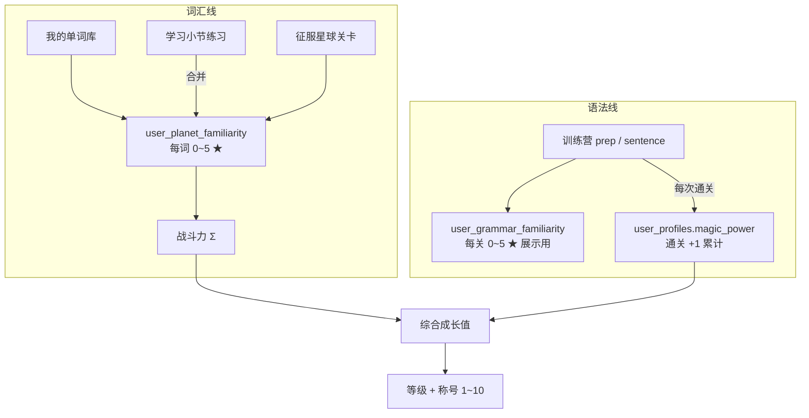
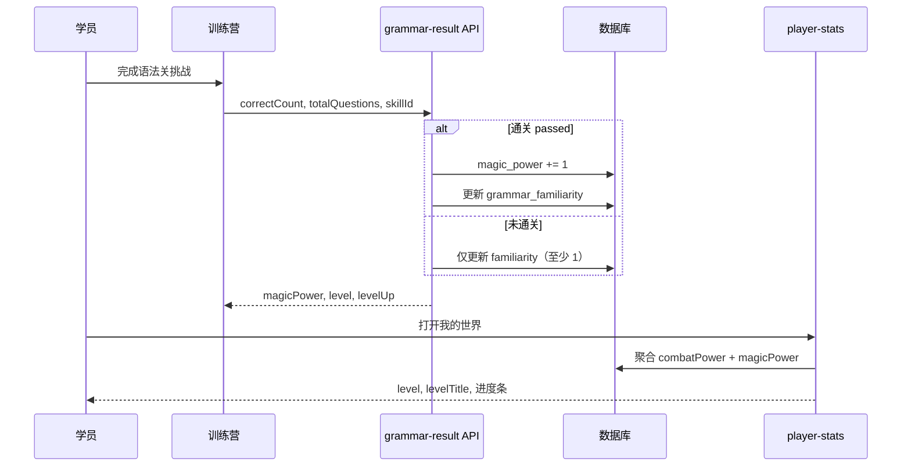

# DOC-PROD-007 玩家三维指标设计

| 项目 | 内容 |
|------|------|
| 文档编号 | DOC-PROD-007 |
| 文档名称 | 玩家三维指标设计（战斗力 / 魔法值 / 等级） |
| 状态 | Approved |
| 版本 | v1.0.0 |
| 适用范围 | 我的世界、征服星球、训练营、学习闭环 |
| 关联文档 | [DOC-PROD-004 学习闭环](DOC-PROD-004-学习闭环系统设计.md)、[DOC-PROD-005 征服星球](DOC-PROD-005-征服星球玩法设计文档.md) |

## 1. 设计目标

用三个玩家可感知的指标统一描述成长进度，并与两条学习主线一一对应：

| 指标 | 玩家感知 | 学习映射 |
|------|----------|----------|
| **战斗力** | 词汇有多熟 | 我的单词库中每个词的熟悉度（★）累加 |
| **魔法值** | 语法练了多少 | 训练营语法关每通关一次 +1，总量不设上限 |
| **等级** | 综合成长 | `战斗力 + 魔法值` 查表，共 **10 级**，每级有独立称号 |

**不单独存储 EXP 字段**：等级与进度条均由战斗力、魔法值实时推导。

### 1.1 与旧术语对照

| 旧称 / 旧字段 | 新称 | 说明 |
|---------------|------|------|
| 战斗力（= 士兵人数） | **军团人数** `armySize` | 仅表示词数，不参与等级 |
| 经验值 `armyExp` | **战斗力** `combatPower` | 全词 familiarity 之和 |
| 军团总战力 `totalPower` | 保留 | 音节×词性，用于战斗结算，与等级无关 |
| MyWorld 占位 EXP | **等级 + 双指标** | 删除写死数值 |

---

## 2. 指标定义

### 2.1 战斗力（Combat Power）

```text
战斗力 = Σ user_planet_familiarity.familiarity
```

- 对每个「我的单词库」中的词，取熟悉度 **0～5**（★ 展示），求和。
- **实时计算**，不冗余存储。
- 数据源：`user_planet_familiarity`（权威表）。

#### 单兵熟悉度获取规则

| 来源 | 规则 |
|------|------|
| 初始化自评进库 | 默认 **2** ★ |
| 征服星球 · 招募 / Boss 收编 | 新词 **1** ★ |
| 学习小节 · 闪卡「认识了」 | +1（写 `section_words`，测评通过时合并） |
| 学习小节 · 选择 / 拼写首次答对 | +1 |
| Word Hunter 胜利 | 本节每词 +1（上限 5） |
| 小节测评通过 | 按 `section_words` 与当前值 **取 max** 合并进 planet 表 |
| 征服星球 · 复习关 | 答对 +1，答错 -1；降至 0 叛逃移出词库 |
| 征服星球 · Boss 战 | 对已入团词拼写/认义答对 +1（同日同词一次） | ✅ |

### 2.2 魔法值（Magic Power）

```text
魔法值 = 语法关累计通关次数（每次通关 +1，不设总量上限）
```

- **每次通关**：一次语法关挑战结束且满足「通关」判定 → 魔法值 **+1**。
- **同一关可重复通关**，每次仍 +1（鼓励复习语法）。
- **不设总量上限**（后续新增语法关、重复刷关均可继续累加）。
- **存储**：`user_profiles.magic_power`（累计计数器）；可选 `user_grammar_pass_log` 留痕。

#### 通关判定

与现训练营逻辑一致：

```text
passed = (correctCount >= totalQuestions)   // 即全部答对
```

非满分结束：**不计通关**，魔法值不变；但可更新该关「语法熟悉度」（见 §2.3）。

### 2.3 语法关熟悉度（Grammar Familiarity，辅助展示）

每关独立 **0～5** ★，用于训练营关卡列表展示，**不参与**魔法值与等级公式（魔法值只看通关次数）。

| 事件 | familiarity 变化 |
|------|------------------|
| 首次通关（100% 正确） | 设为 **3** ★ |
| 重复通关且 100% | **+1**（上限 5） |
| 结束但未满分 | `max(当前, 1)` |
| 同一关同一天 | familiarity 最多 **+1** |

数据源：`user_grammar_familiarity`（`user_id + skill_id`）。

### 2.4 等级（Level）

```text
综合成长值 totalGrowth = 战斗力 + 魔法值
等级 level           = lookupLevel(totalGrowth)    // 1～10
称号 levelTitle      = LEVEL_TITLES[level]
```

#### 等级阈值表（10 级）

| 等级 | 所需综合成长值（≥） | 称号 |
|------|---------------------|------|
| 1 | 0 | 青铜战士 |
| 2 | 40 | 白银士兵 |
| 3 | 100 | 黄金勇士 |
| 4 | 180 | 小队长 |
| 5 | 280 | 中队长 |
| 6 | 400 | 大队长 |
| 7 | 550 | 星尘先锋 |
| 8 | 730 | 传说将军 |
| 9 | 940 | 王者元帅 |
| 10 | 1180 | 至尊星主 |

> 阈值设计：前期约 40～80 一档便于频繁升级；后期拉开，适配词库膨胀与重复刷语法关。  
> 称号叙事：休闲 RPG 段位风（青铜 → 白银 → … → 至尊）；4～6 级采用队伍指挥官递进（小队长 / 中队长 / 大队长），中段完成指挥层成长后再升阶。

#### 等级进度条（UI）

```text
floor   = LEVEL_THRESHOLDS[level]
ceiling = LEVEL_THRESHOLDS[level + 1]  // 10 级时 ceiling 取 cap 或同 floor
progress = (totalGrowth - floor) / (ceiling - floor)
```

---

## 3. 系统架构





---

## 4. 语法关卡清单

魔法值与熟悉度均按 **skill_id** 粒度记录。

### 4.1 精灵起源（prep，12 关）

| skill_id | 标题 |
|----------|------|
| hf-1 | 万能三兄弟 |
| hf-2 | 连续精灵 |
| hf-3 | 截止精灵 |
| hf-4 | 时段精灵 |
| pos-1 | 位置三兄弟 |
| hf-5 | 方位精灵 |
| more-1 | 从属精灵 |
| more-2 | 方式精灵 |
| pos-2 | 穿越精灵 |
| pos-3 | 相对精灵 |
| more-5 | 边缘精灵 |
| more-4 | 综合精灵 |

### 4.2 句型训练营（sentence，15 关）

| skill_id | 标题 |
|----------|------|
| struct-1 | 主谓宾 |
| struct-2 | 定语 |
| struct-3 | 状语入门 |
| adv-time | 时间状语 |
| adv-place | 地点状语 |
| adv-3 | 状语高级 |
| struct-4 | 高级 |
| tense-1 | 一般时态 |
| tense-2 | 完成时 |
| tense-3 | 动词变化 |
| tense-4 | 时态综合 |
| adj-adv-1 | 学者魔法师 1 |
| adj-adv-2 | 学者魔法师 2 |
| adj-adv-3 | 学者魔法师 3 |
| boss | 句型 BOSS |

---

## 5. 数据模型

### 5.1 已有表（复用）

```sql
-- 词汇熟悉度（战斗力数据源）
user_planet_familiarity (
  user_id, word, familiarity, last_reviewed_at
)
```

### 5.2 新增 / 变更

```sql
-- 用户资料表增加魔法值计数
ALTER TABLE user_profiles ADD COLUMN magic_power INTEGER NOT NULL DEFAULT 0;

-- 语法关熟悉度（展示用 ★）
CREATE TABLE user_grammar_familiarity (
  user_id         TEXT NOT NULL,
  skill_id        TEXT NOT NULL,
  module          TEXT NOT NULL,  -- 'prep' | 'sentence'
  familiarity     INTEGER NOT NULL DEFAULT 0 CHECK (familiarity >= 0 AND familiarity <= 5),
  best_score      INTEGER NOT NULL DEFAULT 0,
  total_questions INTEGER NOT NULL DEFAULT 0,
  pass_count      INTEGER NOT NULL DEFAULT 0,
  last_played_at  INTEGER,
  updated_at      INTEGER NOT NULL,
  PRIMARY KEY (user_id, skill_id)
);

-- 可选：通关流水（审计 / 防作弊）
CREATE TABLE user_grammar_pass_log (
  id              TEXT PRIMARY KEY,
  user_id         TEXT NOT NULL,
  skill_id        TEXT NOT NULL,
  module          TEXT NOT NULL,
  correct_count   INTEGER NOT NULL,
  total_questions INTEGER NOT NULL,
  created_at      INTEGER NOT NULL
);
```

### 5.3 等级配置

等级阈值与称号放在服务端常量 `playerLevelConfig.ts`，便于调整，无需入库。

---

## 6. API 设计

### 6.1 玩家指标汇总

```http
GET /learning/player-stats
```

```json
{
  "combatPower": 320,
  "magicPower": 45,
  "totalGrowth": 365,
  "level": 6,
  "levelTitle": "星尘先锋",
  "levelProgress": {
    "current": 365,
    "floor": 280,
    "ceiling": 400
  },
  "armySize": 128,
  "legionBattlePower": 186.5
}
```

### 6.2 语法关结算

```http
POST /training-camp/grammar-result
Content-Type: application/json

{
  "module": "prep",
  "skillId": "hf-1",
  "correctCount": 8,
  "totalQuestions": 8
}
```

```json
{
  "passed": true,
  "familiarity": 3,
  "magicPower": 46,
  "magicGained": 1,
  "combatPower": 320,
  "totalGrowth": 366,
  "level": 6,
  "levelTitle": "星尘先锋",
  "levelUp": false
}
```

### 6.3 征服星球 Session 字段变更

`buildPlanetSession` 返回：

| 旧字段 | 新字段 |
|--------|--------|
| `armyExp` | `combatPower` |

可同时嵌入 `magicPower`、`level`、`levelTitle`（减少前端请求）。

---

## 7. UI 展示

| 位置 | 展示 |
|------|------|
| **我的世界 · 英雄区** | 等级 + 称号；战斗力 / 魔法值双数值；综合成长进度条 |
| **征服星球 · 军团面板** | 军团人数 \| 战斗力 \| 军团总战力 |
| **训练营 · 关卡卡片** | 单关 ★（grammar familiarity）+ 本模块已通关次数（可选） |
| **单词详情 / WordChip** | 单兵 ★（贡献战斗力） |

### 7.1 文案

- **战斗力**：「所有士兵的熟悉度加起来——认词越熟，战斗力越高。」
- **魔法值**：「每打通一次语法关 +1，复习也会涨魔法。」
- **等级**：「战斗力 + 魔法值，双轨一起涨才能升级。」

---

## 8. 迁移与兼容

| 项目 | 策略 |
|------|------|
| prep / sentence localStorage 进度 | 首次调用 grammar-result 或一次性迁移接口写入服务端；之后以服务端为准 |
| 现有 `user_planet_familiarity` | 直接作为战斗力源，无需迁移 |
| `armyExp` 前端引用 | 改为 `combatPower`，保留 `armyExp` 别名一个版本（deprecated） |

---

## 9. 实施分期

| 阶段 | 内容 |
|------|------|
| **P0** | 数据表 + `playerLevelConfig` + `getPlayerStats` + `GET /learning/player-stats` |
| **P0** | `POST /training-camp/grammar-result` + 训练营接 API |
| **P0** | MyWorld / ArmyPanel 接真实指标；`armyExp` → `combatPower` |
| **P1** | localStorage 进度迁移；小节测评合并 familiarity | ✅ 已完成 |
| **P1** | 排行 / 小伙伴榜增加等级列 | ✅ 已完成 |
| **P2** | Boss 战词汇微增益 | ✅ 已完成 |
| **P2** | grammar pass 日频控（可选） | 待定 |

---

## 10. 验收标准

| 编号 | 标准 |
|------|------|
| AC-01 | 战斗力 = 我的库全部词 familiarity 之和，与手动核算一致 |
| AC-02 | 语法关 100% 通关一次，魔法值 +1；同一关再通仍 +1 |
| AC-03 | 非满分结束，魔法值不变，familiarity ≥ 1 |
| AC-04 | 综合成长值达阈值时等级与称号正确跳转 |
| AC-05 | 10 级满级后进度条显示满或封顶文案 |
| AC-06 | 征服星球面板「军团人数」与「战斗力」区分清晰 |

---

## 11. 修订记录

| 版本 | 日期 | 说明 |
|------|------|------|
| v1.0.0 | 2026-06-28 | 初版：确认战斗力=词 familiar 之和；魔法值=通关+1 无上限；10 级称号；语法熟悉度规则 |
| v1.1.0 | 2026-06-28 | P1：测评合并 planet 熟悉度；localStorage 语法进度迁移；小伙伴榜等级/双指标 |
