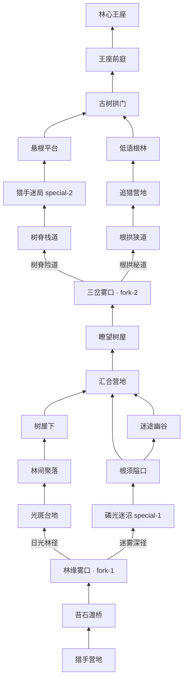

# DOC-PROD-008 迷雾森林国 · 战斗地图设计

> 关联：[DOC-PROD-005 征服星球玩法](DOC-PROD-005-征服星球玩法设计文档.md) · [DOC-PROD-006 过关游戏插件](DOC-PROD-006-征服星球过关游戏插件设计.md)

## 1. 设计目标

为第三王国 **迷雾森林国** 设计一张与场景高度契合的 RPG 战斗地图，满足：

1. **叙事一致**：西侧林带、动词猎手、浓雾密林，与「副词修饰动词」教学主题呼应；
2. **结构升级**：双分叉 + 曲折林径，每条分支含不同关卡组合（含 2 个森林·迷路特殊关）；
3. **视觉区分**：与微光村国（山道+王宫）和食物炊烟国（暖色农田）形成明显差异——冷色、高密树冠、永雾层。

---

## 2. 场景定位

| 维度 | 设定 |
|------|------|
| 王国 | 迷雾森林国（kingdom-3） |
| 大陆位置 | 西侧林带（大陆坐标约 18%, 50%） |
| 难度 | ★★☆ |
| 词库 | 2 音节为主，**动词**为主 |
| 核心机制 | 副词 + 动词搭配（ADV 相生 VERB +20%） |
| BOSS | 林影追猎者 · 动词之影 |
| 进入叙事 | 自南麓炊烟国北上，进入永雾林带 |

**氛围关键词**：浓雾、追猎、动词低语、巨木、根须、冷绿、磷光蘑菇、树屋哨站。

---

## 3. 地图拓扑（双分叉）

自 **猎手营地** 经 **苔石渡桥** 至 **林缘雾口**（第一分叉），选 **日光林径** 或 **迷雾深径** 后于 **汇合营地** 会合；再经 **瞭望树屋** 至 **三岔雾口**（第二分叉），选 **树脊险道** 或 **根拱秘道**，于 **古树拱门** 汇合后登顶 **林心王座**。



### 3.1 第一分叉 · 林缘雾口

| 分支 id | 名称 | 沿途节点 | 特色关卡 |
|---------|------|----------|----------|
| `sunlit` | 日光林径 | 光斑台地 → 林间聚落 → 树屋下 | 招募 recruit-1 |
| `mist-deep` | 迷雾深径 | 磷光迷沼 → 根须隘口 → 迷途幽谷 | **特殊** special-1 + 复习 review-1 |

### 3.2 第二分叉 · 三岔雾口

| 分支 id | 名称 | 沿途节点 | 特色关卡 |
|---------|------|----------|----------|
| `ridge` | 树脊险道 | 树脊栈道 → 猎手迷局 → 悬根平台 | **特殊** special-2 |
| `root` | 根拱秘道 | 根拱狭道 → 追猎营地 → 低语根林 | 招募 recruit-2 + 复习 review-2 |

---

## 4. 路点一览

底图规格：**1024 × 571**（与 kingdom-1-map.png 一致）。坐标为 **百分比**（x%, y%），便于管理台 `?mapEdit` 微调对齐底图。

| 节点 id | 中文名 | terrain | levelId | 坐标 (x, y) | 叙事要点 |
|---------|--------|---------|---------|-------------|----------|
| `start` | 猎手营地 | camp | — | 52.0, 93.0 | 远征军自南进入西侧林带，篝火在雾中明灭 |
| `wp-cliff` | 苔石渡桥 | waypoint | — | 38.0, 84.0 | 覆苔石桥跨暗溪，入林第一关 |
| `recruit-1` | 林间聚落 | village | recruit-1 | 32.0, 76.0 | 林缘村民，以日常**动作动词**应募 |
| `wp-outpost` | 瞭望树屋 | tower | — | 28.0, 69.0 | 树屋哨站，守望雾林动向 |
| `recruit-2` | 追猎营地 | village | recruit-2 | 35.0, 62.0 | 动词猎手营地，招募**追猎类动词** |
| `wp-add-2` | 三岔雾口 | fork | — | 42.0, 55.0 | 浓雾三分，主径继续北上 |
| `review-1` | 迷途幽谷 | valley | review-1 | 30.0, 48.0 | 雾谷回声，走散士兵徘徊 |
| `review-2` | 低语根林 | forest | review-2 | 55.0, 45.0 | 巨树根须间低语，须及时召回老兵 |
| `wp-add-3` | 古树拱门 | waypoint | — | 48.0, 32.0 | 千年巨木天然拱门，通往林心 |
| `wp-add-1` | 林心王座 | castle | boss-1 | 50.0, 14.0 | 空心巨木内的王座，林影追猎者盘踞 |

---

## 5. 关卡配置

| levelId | 类型 | 名称 | 教学重点 | 场景文案 |
|---------|------|------|----------|----------|
| recruit-1 | 招募 | 林间聚落 | 日常动作动词认词 + 造句 | 林缘村民展示 run / jump / swim 等动作，完成认词与造句后入团 |
| recruit-2 | 招募 | 追猎营地 | 追猎/移动类动词 | 动词猎手以 track / chase / climb 等词试炼新兵 |
| review-1 | 复习 | 迷途幽谷 | 抗遗忘（familiarity ≤ 2） | 雾谷中走散的动词武士，叫出名字才能留住 |
| review-2 | 复习 | 低语根林 | 抗遗忘 | 根须低语干扰记忆，须快速认义召回 |
| special-1 | **森林·迷路** | 磷光迷沼 | 副词+动词搭配 | 动词猎手封锁道路，配对成功方可通行 |
| special-2 | **森林·迷路** | 猎手迷局 | 副词+动词搭配 | 浓雾动词陷阱，须以副词逐一破解 |
| boss-1 | BOSS | 林心王座 | 拼写 + ADV→VERB 相生 | 林影追猎者（动词属性）；派出魔法师（副词）+20% |

### 5.1 BOSS 数值建议

| 参数 | 值 |
|------|-----|
| BOSS 名称 | 林影追猎者 |
| BOSS 词性 | 动词 (verb) |
| 封印格数 | 6 |
| 玩家 HP | 100 |
| 答错伤害 | 20 |
| 收编士兵 | 5 词（动词为主，2 音节） |
| 推荐收编示例 | walk, listen, carry, follow, build |

---

## 6. 底图美术方向

### 6.1 与已有王国对比

| 王国 | 主色调 | 地貌 | 地标 |
|------|--------|------|------|
| 微光村国 | 青绿 + 淡雾 + 雪山 | 山道、河流、梯田 | 山顶石堡 |
| 食物炊烟国 | 暖金 + 橙褐 | 农田、果园、河流 | 御膳石城 |
| **迷雾森林国** | **冷绿 + 紫灰雾 + 靛蓝溪** | **高密针叶林、沼泽、巨木** | **空心巨木王座** |

### 6.2 画面分区（供 AI 出图 / 原画）

```
┌─────────────────────────────────────────────┐
│  北 · 林心王座（空心巨木 + 磷光 + 浓雾顶）      │  y ≈ 0–25%
│         ↑ 主径                               │
│  中 · 古树拱门 / 双谷分叉区 / 低语根林           │  y ≈ 25–55%
│         ↑                                    │
│  南 · 追猎营地 → 树屋 → 聚落 → 苔石桥 → 营地   │  y ≈ 55–100%
│  西缘：更密树墙；东缘：略疏林 + 雾带             │
└─────────────────────────────────────────────┘
```

**必备元素**：

- 永雾层：贴地流动雾（左下、谷地、林心周围），非 kingdom-1 的「山顶单点雾」；
- 巨木：北部 1 棵超尺度古树，树干中空露出王座/平台；
- 暗溪：自西向东，苔石渡桥为首个跨水点；
- 树屋哨塔：西部中段的瞭望树屋（非石塔）；
- 磷光蘑菇、发光苔藓：点缀小径，暗示「副词照亮动词」；
- 无农田、无炊烟、无雪山——与 kingdom-2 / kingdom-1 彻底区隔。

### 6.3 AI 出图 Prompt（英文，双分叉版 · kingdom-3-map.png）

```
Isometric hand-drawn fantasy RPG overworld map, 1024x571, misty deep forest kingdom.
Cool teal-green canopy, purple-grey ground fog, indigo stream, cyan bioluminescent mushrooms.
Dense evergreen forest 70%. TWO visible Y-fork dirt paths (not one straight road):

South: hunter camp (tents + campfire) → moss stone bridge over dark stream →
Fork-1 splits:
  East/sunlit: dappled glade, treehouse watchtower in giant tree
  West/mist: bioluminescent swamp, glowing mushroom marsh
  → merge camp center

Main path north: woodland village, lookout treehouse, hunter camp, misty valley →
Fork-2 splits:
  West/ridge: elevated root plank walkway above fog
  East/root: gnarled root arch tunnels
  → natural root arch gateway → hollow giant World Tree throne at north center

No farmland, snow, warm sunset, or text labels. Compass rose top-right.
Soft painterly RPG map style matching kingdom-1/kingdom-2 references.
```

### 6.4 资源路径

| 文件 | 说明 |
|------|------|
| `public/assets/conquer-planet/kingdom-3-map.png` | 战斗地图底图 |
| `src/modules/conquer-planet/data/kingdomBattleMapLayout.ts` | 节点坐标与路径 |
| `server/src/lib/learning/planetKingdomSettings.ts` | 服务端布局同步 |

出图后使用管理台 **战斗地图编辑器** 或 URL 参数 `?mapEdit` 微调节点坐标对齐路径。

---

## 7. 场景文案（路点事件）

| 节点 id | 抵达文案 |
|---------|----------|
| start | 猎手营地篝火在雾中明灭，远征军在此整理弓刃，准备深入西侧永雾林。 |
| wp-cliff | 苔石渡桥横跨暗溪，桥下流水几乎无声，林缘的雾从这里开始变浓。 |
| recruit-1 | 林间聚落藏在巨杉之间，村民以动作动词自报家门，等待你的招募。 |
| wp-outpost | 瞭望树屋悬在枝杈间，哨兵说动词猎手的影子在更北的雾里出没。 |
| recruit-2 | 追猎营地弓弦轻响，动词猎手只接纳能叫对动作名字的新兵。 |
| wp-add-2 | 三岔雾口浓雾翻涌，两条小径在雾中若隐若现，主路仍指向林心。 |
| review-1 | 迷途幽谷里回声重叠，走散的动词武士可能就在雾墙之后。 |
| review-2 | 低语根林的根须沙沙作响，不及时叫出名字，士兵会被林声吞没。 |
| wp-add-3 | 古树拱门由千年根须自然形成，穿过拱门便望见林心巨木的轮廓。 |
| wp-add-1 | 林心王座在空心巨木深处，林影追猎者的动词封印正在此间脉动。 |

---

## 8. 验收标准

| 编号 | 标准 |
|------|------|
| AC-MAP-01 | 底图冷色迷雾森林风格，与 kingdom-1/2 一眼可区分 |
| AC-MAP-02 | 10 个路点坐标与主径在底图上视觉对齐（误差 ≤ 3%） |
| AC-MAP-03 | 5 个关卡名称、类型、词性主题与 DOC-PROD-005 §6 王国 3 一致 |
| AC-MAP-04 | BOSS 关林影追猎者为动词属性，副词相生提示可见 |
| AC-MAP-05 | 路点抵达文案使用「迷雾森林国」语境，不出现微光村国专属地名 |

---

## 9. 实现清单

- [x] 战斗地图布局 `KINGDOM_3_BATTLE_MAP`（双分叉 + 19 路点）
- [x] 关卡配置 `KINGDOM_LEVELS['kingdom-3']`（7 关含 2 森林特殊关）
- [x] 路点场景文案（kingdom-3 专用）
- [x] `forest` 关卡类型 + adv-verb-pair 游戏插件
- [x] 底图 `kingdom-3-map.png` 出图并对齐坐标
- [ ] 用 `?mapEdit` 微调节点坐标对齐底图土路
