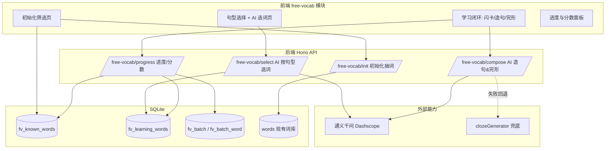
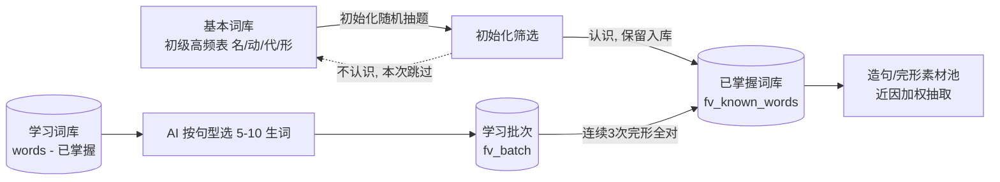
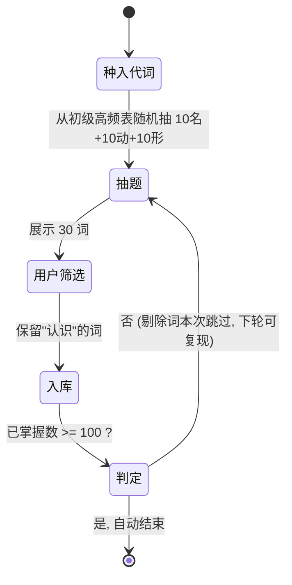
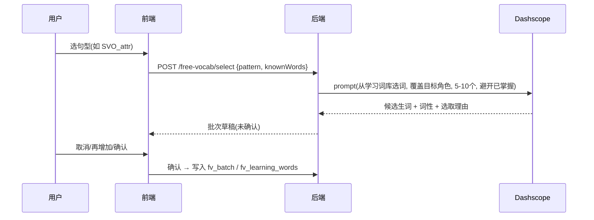
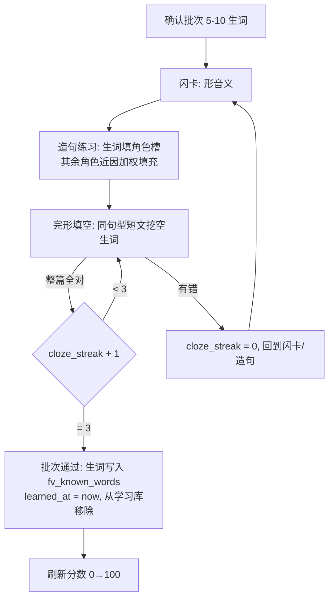

# DOC-DEV-003 自由背单词技术方案

> 关联文档：数据字典见 [DOC-DES-001 自由背单词数据字典](../2.产品设计/DOC-DES-001-自由背单词数据字典.md)；术语见 [DOC-PROD-002 术语表](../2.产品设计/DOC-PROD-002-术语表.md)。

## 1. 方案概述

### 1.1 目标

提供一个 **AI 陪练的自由背单词模式**：用户从词库中通过初始化筛选建立"已掌握词库"，再以"主谓宾定状补"基本句型为线索，由 AI 从"学习词库"中动态选取 5-10 个生词进行背诵；通过闪卡、造句、完形填空形成学习闭环，连续 3 次完形全对即判定通过；页面以"已掌握词数 / 词库总数 × 100"展示 0→100 的学习分数。

### 1.2 定位与边界

- **独立模块**：自有进度与分数存储（`fv_*` 表），**不复用**现有 `user_word_progress`、`user_group_completion` 等进度表。
- **复用现有能力**：
  - 词源复用现有词库（`words` 表 / 初级高频表），无需重录。
  - AI 生成复用已接入的通义千问 Dashscope（`server/src/lib/generateThemePassage.ts` 同源能力）。
  - 完形兜底复用 `src/modules/vocab-training/clozeGenerator.ts`。
  - 句型角色骨架借鉴 `server/src/lib/sentenceStructureTemplates.ts`（`SentenceRole`）。
- **不混用** `sentence-game`（其为语法拼句游戏，目的不同）。

### 1.3 核心特性

| 特性 | 说明 |
|------|------|
| 双词库 | 已掌握词库（素材池）+ 学习词库（待学来源），动态流转 |
| 初始化筛选 | 多轮随机出题（10 名 + 10 动 + 10 形），剔除不认识，攒满 100 自动结束 |
| 句型驱动 | 以主谓宾定状补句型为线索，AI 按缺失角色选生词 |
| 近因加权 | 造句/完形优先复用"已掌握 + 最近学过"的词，越近学频率越高 |
| 通过判定 | 同一批生词连续 3 次完形全对 → 通过 |
| 分数 | 已掌握词数 / 词库总数 × 100（0→100） |

## 2. 总体架构



## 3. 核心概念：双词库模型



- **已掌握词库**（`fv_known_words`）：初始化保留词 + 后续通过的生词，充当造句/完形的"零件库"。
- **学习词库**：逻辑集合 = 词库全集（`words`）− 已掌握词，作为 AI 选生词来源；学习中的生词落 `fv_learning_words` 与 `fv_batch`。

## 4. 初始化筛选状态机

固定基础代词集在初始化开始时自动种入已掌握词库（不参与出题/剔除，计入 100 总量）：

```text
I/you/he/she/it/we/they/this/that/my/your/his/her/its/our/their
```



**实现要点**：

- 抽题按词性分别随机：从初级高频表中 `pos='noun'` / `'verb'` / `'adj'` 各随机取 10，去重已抽过的词。
- "不认识"的词不写任何库，仅本轮排除；保留在词池中，后续轮次可能再次被抽到。
- 终止条件：`fv_known_words` 计数（含代词）≥ 100 时自动结束初始化。
- 前置数据任务：初级高频表需补全词性标注，并将代词从 `other` 中单独标出（见 §9）。

## 5. 句型驱动选词机制（主谓宾定状补）

### 5.1 句型 → 角色槽映射

复用 `SentenceRole`（`subject/predicate/object/attributive/adverbial/complement`）作为槽位骨架。用户选择目标句型，系统据此确定需要哪些词性补槽：

| 句型代码 | 句型 | 角色槽（词性） |
|----------|------|----------------|
| `SV` | 主谓 | 主语(名/代) + 谓语(动) |
| `SVO` | 主谓宾 | 主语(名/代) + 谓语(动) + 宾语(名/代) |
| `SVP` | 主系表 | 主语(名/代) + 系动词(be) + 表语(形/名) |
| `SVO_attr` | 主谓宾 + 定语 | 在主/宾前加 定语(形) |
| `SVO_adv` | 主谓宾 + 状语 | 加 状语(副/介短) |
| `SVOC` | 主谓宾宾补 | 加 宾补(形/名) |

> 句型由易到难解锁：`SV → SVO → SVP → SVO_attr → SVO_adv → SVOC`。

### 5.2 AI 选词流程



- AI 选词约束：只能从词库内选、避开已掌握词、数量 5-10、覆盖目标句型缺失角色的词性。
- "取消/再增加"在确认前为前端草稿态，确认后才落库为 `fv_batch`。

## 6. 近因加权素材池算法

造句/完形的用词候选池 = 当前批次生词 ∪ 已掌握词（含初始化词 + 历史通过词）。每个候选词抽取权重：

```text
weight(w) = isCurrentBatch(w) ? +∞(强制纳入)
          : recencyBoost · exp( -(now - learnedAt(w)) / τ )   // 近因衰减, τ ≈ 7 天
          + familiarityBonus                                   // 已掌握更稳, 适合做背景词
```

- `learnedAt`：初始化词 = 标定时刻（较早，权重低，做稳定背景）；通过的生词 = 通过时刻（最近，权重高，频繁复现）。
- 当前批次生词强制纳入，保证测评覆盖目标词；其余角色按权重随机采样填充。
- 该权重同时驱动：AI 造句 prompt 的"优先用词"列表 与 完形挖空目标的选择。

## 7. 学习闭环与通过判定



- **通过判定**：完形整篇全对 → `fv_batch.cloze_streak + 1`；任一空错 → 清零。`cloze_streak >= 3` → 批次 `status='passed'`，批次内生词写入 `fv_known_words`（`source='learned'`、`learned_at=now`）。

## 8. 分数与进度口径

- **进度条 / 分数（统一口径）**：`score = round(已掌握词数 / 词库总词数 × 100)`，范围 0→100。
- **已掌握词数**：`fv_known_words` 计数（含初始化词、代词、通过的生词）。
- **词库总词数**：所选词库（tier/分组）的 `words` 总数。
- 面板展示：词库总数、已掌握数、学习中数、当前分数与进度条。

## 9. 前置数据任务

| 任务 | 说明 | 影响 |
|------|------|------|
| 词性标注补全 | 为初级高频表补全 `pos`，并将代词从 `other` 单独标出（建议新增 `pos='pronoun'` 或维护固定代词表） | 初始化"按词性各抽 10"、句型角色匹配 |
| 固定代词集 | 维护一份基础代词常量（主格/物主/指示） | 初始化自动种入 |

## 10. API 接口定义（草案）

| 方法 | 路径 | 入参 | 出参 |
|------|------|------|------|
| POST | `/api/free-vocab/init/draw` | `{ tierId, excludeWords[] }` | 本轮 30 词（10 名/动/形） |
| POST | `/api/free-vocab/init/keep` | `{ words[] }` | 入库结果 + 当前已掌握总数 + 是否结束 |
| POST | `/api/free-vocab/select` | `{ tierId, pattern, count }` | 候选生词草稿（词 + 词性 + 理由） |
| POST | `/api/free-vocab/batch` | `{ pattern, words[] }` | 批次 ID |
| POST | `/api/free-vocab/compose` | `{ batchId, mode: 'sentence'\|'cloze' }` | 句子/完形短文（英 + 中，含挖空） |
| POST | `/api/free-vocab/cloze/submit` | `{ batchId, answers[] }` | 是否全对 + cloze_streak + 是否通过 |
| GET | `/api/free-vocab/progress` | `{ tierId }` | 词库总数 / 已掌握 / 学习中 / 分数 |

> 接口需登录鉴权（复用 `server/src/auth.ts`）。`compose` 失败时后端回退到 `clozeGenerator.buildClozeFromExamples`。

## 11. 模块与文件结构

```text
src/modules/free-vocab/
├── FreeVocabModule.tsx       # 模块容器, 阶段路由(初始化/选词/学习)
├── InitCalibration.tsx       # 初始化筛选页
├── PatternSelect.tsx         # 句型选择
├── AiWordPicker.tsx          # AI 选词草稿(取消/再加/确认)
├── StudyLoop.tsx             # 闪卡 + 造句 + 完形闭环
├── ProgressPanel.tsx         # 词库总数 / 进度 / 分数
├── api.ts                    # 调用后端
├── recencyPool.ts            # 近因加权候选池(前端预览用)
└── types.ts                  # 句型/角色/批次类型

server/src/
├── routes/freeVocab.ts       # 上述 API
└── lib/
    ├── freeVocabInit.ts      # 初始化抽词逻辑
    ├── freeVocabSelect.ts    # AI 选词(Dashscope)
    ├── freeVocabCompose.ts   # AI 造句/完形 + 兜底
    └── recencyWeight.ts      # 近因加权公式
```

## 12. 开发拆解（里程碑）

| 阶段 | 内容 |
|------|------|
| M1 | 数据：`fv_*` 建表 + 初级高频表词性/代词标注 |
| M2 | 初始化筛选（抽词 / 剔除 / 攒满 100） |
| M3 | 句型选择 + AI 选词（含取消/再加/确认） |
| M4 | 学习闭环（闪卡 + 近因加权造句 + 完形 + 连续 3 次通过） |
| M5 | 进度与分数面板 |
| M6 | AI 兜底、联调与体验优化 |
