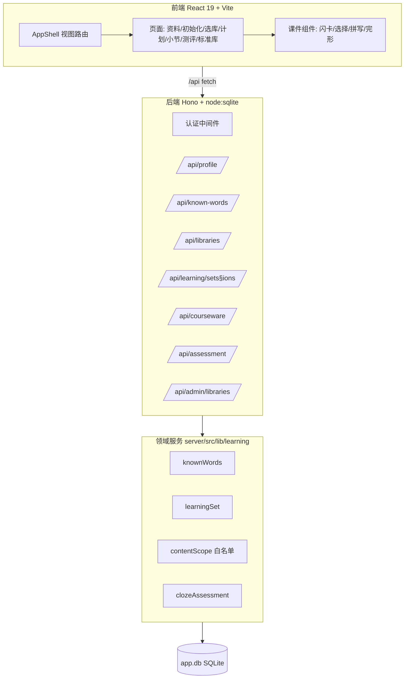
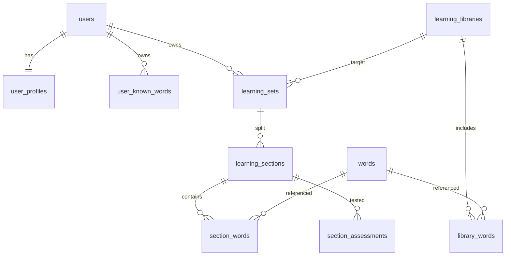

# DOC-DEV-004 学习闭环技术方案与数据字典

| 项目 | 内容 |
|------|------|
| 文档编号 | DOC-DEV-004 |
| 文档名称 | 学习闭环技术方案与数据字典 |
| 状态 | Draft |
| 版本 | v1.0.0 |
| 关联 | DOC-PROD-004 学习闭环系统设计 |

## 1. 技术架构



技术选型保持不变：React 19 / TypeScript / Vite 8 / Hono / `node:sqlite`（无 ORM，原生 SQL）。
新增领域服务统一置于 `server/src/lib/learning/`，前端新增 `src/modules/learning/`。

## 2. 数据模型（ER）



> 共享词库表 `tiers`、`words` 由 Python 构建脚本维护，结构不变。

## 3. 数据字典

### 3.1 learning_libraries（学习单词库，共享）

| 字段 | 类型 | 约束 | 说明 |
|------|------|------|------|
| id | TEXT | PK | 学习库 ID |
| name | TEXT | NOT NULL | 库名称 |
| description | TEXT | DEFAULT '' | 描述 |
| source_tier | TEXT | NULL | 来源档位（beginner/intermediate/advanced），可空表示混合 |
| word_count | INTEGER | DEFAULT 0 | 冗余词数 |
| sort_order | INTEGER | DEFAULT 0 | 排序 |
| is_active | INTEGER | DEFAULT 1 | 是否上架 |
| created_at | INTEGER | NOT NULL | 创建时间 |

### 3.2 library_words（学习库-单词关联，共享）

| 字段 | 类型 | 约束 | 说明 |
|------|------|------|------|
| library_id | TEXT | PK,FK→learning_libraries | 学习库 |
| word_id | INTEGER | PK,FK→words | 标准库单词 |
| sort_order | INTEGER | DEFAULT 0 | 库内排序 |

### 3.3 user_profiles（学员资料）

| 字段 | 类型 | 约束 | 说明 |
|------|------|------|------|
| user_id | TEXT | PK,FK→users | 用户 |
| grade | TEXT | DEFAULT '' | 年级 |
| current_library_id | TEXT | NULL,FK→learning_libraries | 当前学习库 |
| init_done | INTEGER | DEFAULT 0 | 我的库是否完成初始化 |
| updated_at | INTEGER | NOT NULL | 更新时间 |

### 3.4 user_known_words（我的单词库）

| 字段 | 类型 | 约束 | 说明 |
|------|------|------|------|
| user_id | TEXT | PK,FK→users | 用户 |
| word | TEXT | PK | 单词（小写规范化） |
| pos | TEXT | DEFAULT 'other' | 词性 |
| source | TEXT | DEFAULT 'init' | 来源：init/section_pass/manual/pronoun |
| learned_at | INTEGER | DEFAULT 0 | 掌握时间 |

### 3.5 learning_sets（学习集）

| 字段 | 类型 | 约束 | 说明 |
|------|------|------|------|
| id | TEXT | PK | 学习集 ID |
| user_id | TEXT | FK→users | 用户 |
| library_id | TEXT | FK→learning_libraries | 目标学习库 |
| size | INTEGER | NOT NULL | 单词总数 |
| section_count | INTEGER | NOT NULL | 小节数 |
| status | TEXT | DEFAULT 'active' | active/completed |
| created_at | INTEGER | NOT NULL | 创建时间 |
| completed_at | INTEGER | NULL | 完成时间 |

### 3.6 learning_sections（学习小节）

| 字段 | 类型 | 约束 | 说明 |
|------|------|------|------|
| id | TEXT | PK | 小节 ID |
| set_id | TEXT | FK→learning_sets | 所属学习集 |
| user_id | TEXT | FK→users | 冗余用户（隔离查询） |
| seq | INTEGER | NOT NULL | 小节序号（从 1） |
| status | TEXT | DEFAULT 'locked' | locked/learning/passed |
| passage_en | TEXT | DEFAULT '' | 测评短文（缓存，可空） |
| passage_zh | TEXT | DEFAULT '' | 短文译文 |
| passed_at | INTEGER | NULL | 通过时间 |

### 3.7 section_words（小节单词）

| 字段 | 类型 | 约束 | 说明 |
|------|------|------|------|
| section_id | TEXT | PK,FK→learning_sections | 小节 |
| word_id | INTEGER | PK,FK→words | 单词 |
| word | TEXT | NOT NULL | 单词文本（冗余） |
| familiarity | INTEGER | DEFAULT 0 | 课件熟悉度 0–5 |

### 3.8 section_assessments（小节测评记录）

| 字段 | 类型 | 约束 | 说明 |
|------|------|------|------|
| id | TEXT | PK | 记录 ID |
| section_id | TEXT | FK→learning_sections | 小节 |
| user_id | TEXT | FK→users | 用户 |
| total | INTEGER | NOT NULL | 题目空数 |
| correct | INTEGER | NOT NULL | 答对空数 |
| passed | INTEGER | NOT NULL | 是否通过 |
| created_at | INTEGER | NOT NULL | 提交时间 |

### 3.9 枚举值

- `learning_sections.status`：locked（未解锁）/ learning（学习中）/ passed（已通过）
- `learning_sets.status`：active（进行中）/ completed（已完成）
- `user_known_words.source`：init / section_pass / manual / pronoun
- 测评通过：`correct == total`（默认全对通过，可由配置放宽）

## 4. API 规范

统一前缀 `/api`，除标注外均需登录（Cookie 会话）。响应统一 JSON，错误 `{ error }`。

### 4.1 学员资料 `/api/profile`

| 方法 | 路径 | 说明 |
|------|------|------|
| GET | `/` | 获取资料+统计（我的库词数、当前库、初始化状态） |
| PUT | `/` | 更新 grade / displayName |
| PUT | `/current-library` | 设定当前学习库 `{ libraryId }` |

### 4.2 我的单词库 `/api/known-words`

| 方法 | 路径 | 说明 |
|------|------|------|
| GET | `/` | 列出我的库单词 |
| GET | `/init/draw` | 抽取一批自评候选词 `?tier=` |
| POST | `/init/keep` | 保留认识的词 `{ words[] }` |
| GET | `/init/status` | 初始化进度 |

### 4.3 学习库 `/api/libraries`

| 方法 | 路径 | 说明 |
|------|------|------|
| GET | `/` | 列出上架学习库 |
| GET | `/:id/words` | 学习库单词（含是否已掌握标记） |

### 4.4 学习集与小节 `/api/learning`

| 方法 | 路径 | 说明 |
|------|------|------|
| GET | `/active` | 当前活跃学习集+小节列表 |
| POST | `/sets` | 基于当前学习库创建学习集 `{ libraryId?, size? }` |
| GET | `/sections/:id` | 小节详情（含单词列表+解锁状态） |
| POST | `/sections/:id/familiarity` | 更新课件熟悉度 `{ word, familiarity }` |

### 4.5 课件内容 `/api/courseware`

| 方法 | 路径 | 说明 |
|------|------|------|
| GET | `/section/:id/cards` | 小节闪卡数据（单词+受约束例句） |
| GET | `/section/:id/quiz` | 选择题（干扰项来自白名单） |

### 4.6 测评 `/api/assessment`

| 方法 | 路径 | 说明 |
|------|------|------|
| GET | `/section/:id/cloze` | 生成完形填空（短文用词限白名单，挖空为本节词） |
| POST | `/section/:id/submit` | 提交答案，判定通过并纳入我的库 |

### 4.7 管理后台 `/api/admin/libraries`

| 方法 | 路径 | 说明 |
|------|------|------|
| GET | `/` | 列出全部学习库 |
| POST | `/` | 新建学习库 `{ name, description, sourceTier }` |
| PUT | `/:id` | 编辑学习库 |
| DELETE | `/:id` | 删除学习库 |
| PUT | `/:id/words` | 设置库内单词 `{ wordIds[] }` |
| POST | `/:id/words/from-tier` | 从某档批量导入 `{ tier, limit? }` |

## 5. 内容自洽约束实现

`contentScope(userId, sectionId)` 返回白名单词集合：

```text
whitelist = SELECT word FROM user_known_words WHERE user_id = ?
          ∪ SELECT word FROM section_words WHERE section_id = ?
```

- **选择题干扰项**：从白名单对应单词的 `meaning_zh` 取随机释义。
- **完形短文**：优先取本节单词 `example_en`，仅保留例句中除目标词外用词都落在白名单内的句子；
  挖空目标为本节词；不足时回退到自动拼接例句（沿用 `clozeGenerator`）。
- **AI 生成（可选增强）**：将白名单作为 prompt 词池，复用 `freeVocabSelect` 的「只能从列表选词」模式。

## 6. 兼容与迁移

- 保留 `words`/`tiers`/`users`/`sessions`/`admin_sessions`。
- 重置策略（开发期）：清空并废弃旧学习数据表
  （`user_word_progress`/`user_group_completion`/`user_tier_groups`/`user_word_assignments`/
  `user_wordbook`/`fv_*`/`game_*`），由新表替代。
- 新表通过 `db.ts` 内 `CREATE TABLE IF NOT EXISTS` 自动建立。
- 首次启动自动从 `beginner/intermediate/advanced` 各生成一个默认学习库（便于开箱即用）。

## 7. 模块映射（旧→新）

| 旧模块 | 去向 |
|--------|------|
| vocab-training | 拆解：闪卡/选择/完形组件复用为课件；分组逻辑由学习集小节替代 |
| free-vocab | 理念升级为学习集闭环；init 逻辑复用为我的库初始化 |
| prep-game | 保留为扩展课件入口 |
| sentence-game | 保留为扩展课件入口 |
| Word Hunter | 扩展游戏 | 复用为战斗引擎；小节内入口保留 |
| 征服星球 | 扩展游戏 | Word Hunter 战略养成层升级；独立入口 `/conquer`，见 [DOC-PROD-005](../2.产品设计/DOC-PROD-005-征服星球玩法设计文档.md) |
